# northbay-gstn-kaf-elas
Cloudformation templates and scripts for a reference implementation of AWS Ground Station sending messages to a Kafka Cluster with Cloudwatch Streaming to ElasticSearch

[Northbay Blog](https://northbaysolutions.com/)
------------------------------------------------------------------------------------------

Bringing Space to the Cloud: A Step By Step Guide.
==========================================================

### High-level solution overview

Today we're going to be showing you how to combine 4 cloud technologies into a cloud native satellite radio transmission receiver that streams in a highly scalable way to a searchable index.

[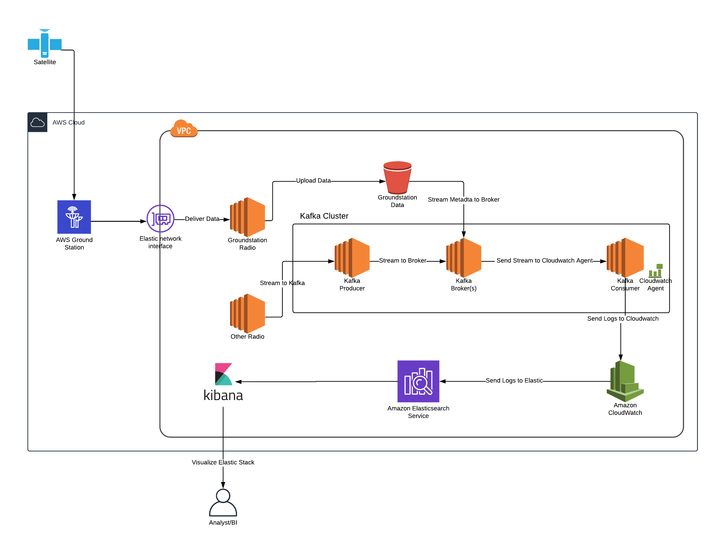](./images/arch.png)

## Components

Northbay has created a Cloudformation Template that downloads data from AWS Ground Station into AWS Elasticsearch using Kafka. The pipeline was created using the following components:

  AWS Ground Station

AWS Ground Station is a fully managed service that lets you control satellite communications, process data, and scale your operations without having to worry about building or managing your own ground station infrastructure. Satellites are used for a wide variety of use cases, including weather forecasting, surface imaging, communications, and video broadcasts. Ground stations form the core of global satellite networks.

[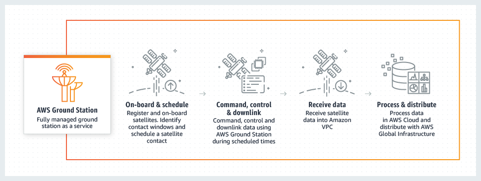](./images/groundstation.png)
[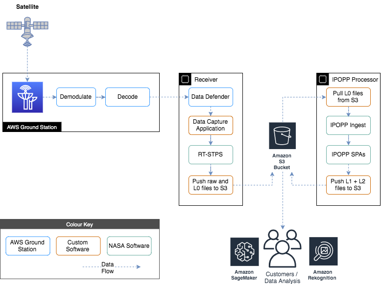](./images/Ground-Station-tech-1.png)

  AWS VPC quickstart

This Quick Start provides a networking foundation based on AWS best practices for your AWS Cloud infrastructure. It builds a virtual private network (VPC) environment with public and private subnets where you can launch AWS services and other resources.

  Apache Kafka using the Confluent Community Edition Platform

Confluent Platform makes it easy to build real-time data pipelines and streaming applications by integrating data from multiple sources and locations into a single, central Event Streaming Platform for your company. Confluent Platform lets you focus on how to derive business value from your data rather than worrying about the underlying mechanics such as how data is being transported or massaged between various systems. Specifically, Confluent Platform simplifies connecting data sources to Kafka, building applications with Kafka, as well as securing, monitoring, and managing your Kafka infrastructure.

At the core of Confluent Platform is
<a href="https://kafka.apache.org/" class="reference external">Apache Kafka</a>,
the most popular open source distributed streaming platform. The key
capabilities of Kafka are:

-   Publish and subscribe to streams of records
-   Store streams of records in a fault tolerant way
-   Process streams of records

The key components of the Kafka open source project are Kafka Brokers
and Kafka Java Client APIs.

Kafka Brokers  
Kafka brokers that form the messaging, data persistency and storage tier
of Kafka.

Kafka Java Client APIs  
-   <a href="https://docs.confluent.io/current/clients/index.html#kafka-clients" class="reference internal">Producer API</a>
    is a Java Client that allows an application to publish a stream
    records to one or more Kafka topics.
-   <a href="https://docs.confluent.io/current/clients/index.html#kafka-clients" class="reference internal">Consumer API</a>
    is a Java Client that allows an application to subscribe to one or
    more topics and process the stream of records produced to them.
-   <a href="https://docs.confluent.io/current/streams/index.html#kafka-streams" class="reference internal">Streams API</a>
    allows applications to act as a stream processor, consuming an input
    stream from one or more topics and producing an output stream to one
    or more output topics, effectively transforming the input streams to
    output streams. It has a very low barrier to entry, easy
    operationalization, and a high-level DSL for writing stream
    processing applications. As such it is the most convenient yet
    scalable option to process and analyze data that is backed by Kafka.
-   <a href="https://docs.confluent.io/current/connect/references/javadocs.html#connect-javadocs" class="reference internal">Connect API</a>
    is a component that you can use to stream data between Kafka and
    other data systems in a scalable and reliable way. It makes it
    simple to configure connectors to move data into and out of Kafka.
    Kafka Connect can ingest entire databases or collect metrics from
    all your application servers into Kafka topics, making the data
    available for stream processing. Connectors can also deliver data
    from Kafka topics into secondary indexes like Elasticsearch or into
    batch systems such as Hadoop for offline analysis.

Each release of Confluent Platform includes the latest release of Kafka
and additional tools and services that make it easier to build and
manage an Event Streaming Platform.

[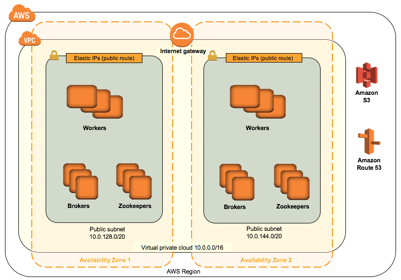](./images/confluent_stack.png)
[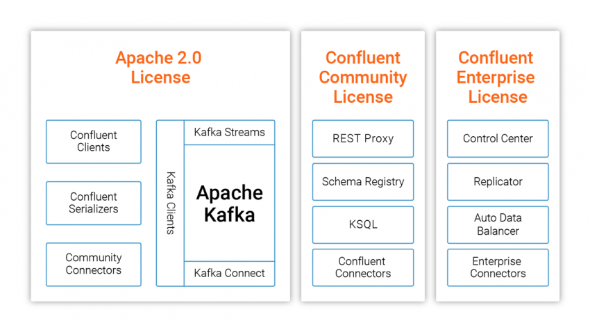](./images/confluent_community.png)

  AWS Cloudwatch Streaming to ElasticSearch and Kibana

You can configure a CloudWatch Logs log group to stream data it receives to your Amazon Elasticsearch Service (Amazon ES) cluster in near real-time through a CloudWatch Logs subscription.

[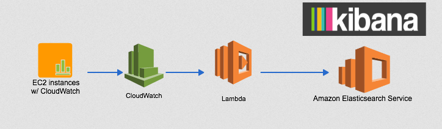](./images/es_stream.png)

###

### TLDR Step by Step 

This demo allows you to stream, demodulate and decode a few sample radio transmissions as input and record them in an ElasticSearch Cluster. If you want to use real satellite transmissions piece, you will need to first onboard your AWS in Ground Station and apply for downlink only (read only) access to Norad id 27424, [Aqua](https://en.wikipedia.org/wiki/Aqua_(satellite)) precipitation, evaporation and water cycling data gathering satellite. 

Steps:

1. Generate a us-east-2 keypair if you don't have one already. 

        aws ec2 create-key-pair --key-name my_key --region us-east-2 | jq -r .KeyMaterial > my_key.pem

2. Create a bucket in us-east-2 to store and run the required templates and software. 

        your_bucket=my_bucket
        aws s3 mb s3://$your_bucket --region us-east-2
        git clone https://github.com/Sam-NB/northbay-gstn-kaf-elas
        cd northbay-gstn-kaf-elas 
        aws s3 sync . s3://$your_bucket --exclude ".git*"

3. Fire off the all inclusive cloudformation deploy. (us-east-2). (Costs will be incurred on your account but spot instances will be used by default for the Kafka nodes. Additionally, in order to save receiver andn processor costs while waiting for your scheduled satellite contact you can safely stop the receiver and processor instances and simply start them up 15 minutes before your receive window. After processing they can be safely stopped until you need them again next time. 
)

        # setup some required vars
        Env=demo
        region=us-east-2
        my_ip=$(curl "http://myexternalip.com/raw")
        url=$(aws s3 presign s3://$your_bucket/src/templates/northbay-kafka-groundstation-elasticsearch-master.template.yaml)
        
        # create the aws resources via cf stack
        aws cloudformation create-stack --stack-name NB-Gstn-Kaf-Elas \
        --template-url $url \
        --region $region \
        --capabilities CAPABILITY_NAMED_IAM CAPABILITY_IAM \
        --parameters \
        ParameterKey=AquaGroundStationCFTemplateVersion,ParameterValue=1 \
        ParameterKey=AquaGroundStationCreateReceiverInstance,ParameterValue=true \
        ParameterKey=AssignPublicIP,ParameterValue=true \
        ParameterKey=AvailabilityZones,ParameterValue="${region}a\,${region}b" \
        ParameterKey=BootDiskSize,ParameterValue=24 \
        ParameterKey=BrokerNodeInstanceType,ParameterValue=m4.large \
        ParameterKey=BrokerNodeSpotPrice,ParameterValue=0.05 \
        ParameterKey=BrokerNodeStorage,ParameterValue=40 \
        ParameterKey=BrokerNodeStorageType,ParameterValue=gp2 \
        ParameterKey=ClusterName,ParameterValue=kafka \
        ParameterKey=ConfluentEdition,ParameterValue="Confluent Open Source" \
        ParameterKey=ConfluentVersion,ParameterValue=5.0.0 \
        ParameterKey=ConnectorURLs,ParameterValue=- \
        ParameterKey=EBSIOPS,ParameterValue=0 \
        ParameterKey=EBSVolumeSize,ParameterValue=10 \
        ParameterKey=EBSVolumeType,ParameterValue=gp2 \
        ParameterKey=ElasticSearchInstanceCount,ParameterValue=1 \
        ParameterKey=ElasticSearchInstanceType,ParameterValue=t2.small.elasticsearch \
        ParameterKey=ElasticsearchVersion,ParameterValue=7.4 \
        ParameterKey=Env,ParameterValue=$Env \
        ParameterKey=GroundStationInstanceType,ParameterValue=m5.4xlarge \
        ParameterKey=GroundStationSatelliteName,ParameterValue=AQUA \
        ParameterKey=GroundstationMessageLogGroupName,ParameterValue=/$Env/groundstation/messages \
        ParameterKey=IpoppPassword,ParameterValue=ComplexPassword123 \
        ParameterKey=KafkaTopic,ParameterValue=groundstation \
        ParameterKey=KafkaTopicPartitions,ParameterValue=1 \
        ParameterKey=KafkaTopicReplicationFactor,ParameterValue=0 \
        ParameterKey=KeyPairName,ParameterValue=my_key \
        ParameterKey=LinuxOSAMI,ParameterValue=Amazon-Linux-HVM \
        ParameterKey=LogGroupName,ParameterValue=/dev/groundstation/messages \
        ParameterKey=NumBrokers,ParameterValue=1 \
        ParameterKey=NumConsumerWorkers,ParameterValue=1 \
        ParameterKey=NumProducerWorkers,ParameterValue=1 \
        ParameterKey=NumZookeepers,ParameterValue=0 \
        ParameterKey=PrivateSubnet1CIDR,ParameterValue=10.0.0.0/19 \
        ParameterKey=PrivateSubnet2CIDR,ParameterValue=10.0.32.0/19 \
        ParameterKey=PublicSubnet1CIDR,ParameterValue=10.0.128.0/20 \
        ParameterKey=PublicSubnet2CIDR,ParameterValue=10.0.144.0/20 \
        ParameterKey=QSS3BucketName,ParameterValue=$your_bucket \
        ParameterKey=QSS3KeyPrefix,ParameterValue=src/ \
        ParameterKey=RemoteAccessCIDR,ParameterValue=$my_ip/32 \
        ParameterKey=SSHAccessCIDR,ParameterValue=$my_ip/32 \
        ParameterKey=VPCCIDR,ParameterValue=10.0.0.0/16 \
        ParameterKey=WorkerNodeInstanceType,ParameterValue=m4.xlarge \
        ParameterKey=WorkerNodeSpotPrice,ParameterValue=0.10 \
        ParameterKey=WorkerNodeStorage,ParameterValue=0 \
        ParameterKey=ZookeeperNodeInstanceType,ParameterValue=m4.large \
        ParameterKey=ZookeeperNodeSpotPrice,ParameterValue=0.05 \
        ParameterKey=ZookeeperNodeStorage,ParameterValue=0

4. Wait for the EC2 instance bootstrap userdata scripts to execute, approx (5 minutes)
5. Add Bucket Notifications to push processed Gstation files to the created kafka topic.

        #some required vars
        your_account=$(aws sts get-caller-identity --output text --query 'Account')
        lambda=$(echo S3ToKafkaTopic_$Env)

        #add permissions and notifications on both the bucket and lambda function
        sed  "s/LAMBDA_FUNCTION/$lambda/g; s/REGION/$region/g; s/ACCOUNT_ID/$your_account/g" src/templates/event_sub.json  > sub.json
        aws lambda add-permission --function-name $lambda --statement-id lambda_invoker --action "lambda:InvokeFunction" --principal s3.amazonaws.com --source-arn "arn:aws:s3:::$your_bucket" --source-account $your_account --region $region
        aws s3api put-bucket-notification-configuration --bucket $your_bucket --notification-configuration file://sub.json

6. Send sample radio data to the open port on one of the the kafka producer nodes or Schedule a contact in the Groundstation UI.  

[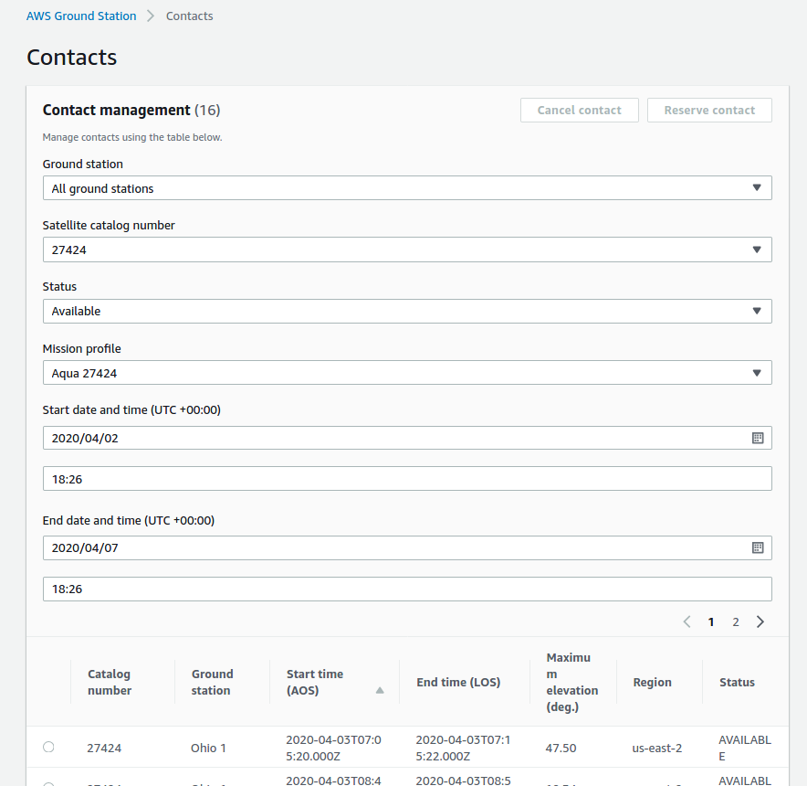](./images/schedule_contact.png)

7. Manual mode

On our reference non groundstation SDR demodulator implementation, we have preconfigured multimon-ng a RTL-SDR compatible digital mode decoder that works on multiple protocols. For this example we are going to simulate receiving a tcp stream of Morse code in Continuous Wave. You can point your sdr to that port or use the sample file from wikipedia as below. The producer node will decode messages on received on tcp port 7355 and pipe those to our Kafka topic for ingestion and streaming to Elastic Search. 

    
        #download a sample Morse CW radio transmission
        wget https://upload.wikimedia.org/wikipedia/commons/0/04/Wikipedia-Morse.ogg
        ffmpeg -i Wikipedia-Morse.ogg -f s16le -acodec pcm_s16le Wikipedia-Morse.raw
        
        # what the raw file sounds like
        cat Wikipedia-Morse.raw | aplay -r 48k -f S16_LE -t raw -c 1

        # this is the decoding that happens on the producer node
        cat Wikipedia-Morse.raw | multimon-ng -a MORSE_CW -t raw -

        #test connectivity and simulate a transmission
        producer=$(aws ec2 describe-instances --region us-east-2 --output text |dos2unix| sed ':a;N;$!ba;s/\n/ /g' | sed "s/\(RESERVATIONS\)/\n\1/g" | grep kafka-producer | awk '{print $43}' | tail -n 1)
        nc -vz $producer 7355
        
        # transmit your tcp message to the producer node. 
        cat Wikipedia-Morse.raw | nc $producer 7355

###

7. Ground Station mode

Once you have onboarded your account you can schedule a contact and if you leave the receiver and processor instances up during your receiver window the output raw and processed data will be uploaded to the s3 bucket you configured in step 2. The notfications you configured in step 5 will then stream the file info into Kafka and ElasticSearch. 

The sample folder structure would look like:

    your_bucket
    ├── data
    │   ├── AQUA
    │   │   ├── gbad
    │   │   │   ├── P1540957AAAAAAAAAAAAAA20090170507000.PDS
    │   │   │   ├── P1540957AAAAAAAAAAAAAA20090170507001.att
    │   │   │   ├── P1540957AAAAAAAAAAAAAA20090170507001.eph
    │   │   │   └── P1540957AAAAAAAAAAAAAA20090170507001.PDS
    │   │   ├── level0
    │   │   │   ├── P1540064AAAAAAAAAAAAAA20090180620000.PDS
    │   │   │   ├── P1540064AAAAAAAAAAAAAA20090180620001.PDS
    │   │   │   ├── P1540141AAAAAAAAAAAAAA20090170507000.PDS
    │   │   │   ├── P1540141AAAAAAAAAAAAAA20090170507001.PDS
    │   │   │   ├── P1540141AAAAAAAAAAAAAA20090180620000.PDS
    │   │   │   ├── P1540141AAAAAAAAAAAAAA20090180620001.PDS
    │   │   │   ├── P1540157AAAAAAAAAAAAAA20090170507000.PDS
    │   │   │   ├── P1540157AAAAAAAAAAAAAA20090170507001.PDS
    │   │   │   ├── P1540157AAAAAAAAAAAAAA20090180620000.PDS
    │   │   │   ├── P1540157AAAAAAAAAAAAAA20090180620001.PDS
    │   │   │   ├── P1540261AAAAAAAAAAAAAA20090170507000.PDS
    │   │   │   ├── P1540261AAAAAAAAAAAAAA20090170507001.PDS
    │   │   │   ├── P1540261AAAAAAAAAAAAAA20090180620000.PDS
    │   │   │   ├── P1540261AAAAAAAAAAAAAA20090180620001.PDS
    │   │   │   ├── P1540262AAAAAAAAAAAAAA20090170507000.PDS
    │   │   │   ├── P1540262AAAAAAAAAAAAAA20090170507001.PDS
    │   │   │   ├── P1540262AAAAAAAAAAAAAA20090180620000.PDS
    │   │   │   ├── P1540262AAAAAAAAAAAAAA20090180620001.PDS
    │   │   │   ├── P1540342AAAAAAAAAAAAAA20090170507000.PDS
    │   │   │   ├── P1540342AAAAAAAAAAAAAA20090170507001.PDS
    │   │   │   ├── P1540342AAAAAAAAAAAAAA20090180620000.PDS
    │   │   │   ├── P1540342AAAAAAAAAAAAAA20090180620001.PDS
    │   │   │   ├── P1540404AAAAAAAAAAAAAA20090170507000.PDS
    │   │   │   ├── P1540404AAAAAAAAAAAAAA20090170507001.PDS
    │   │   │   ├── P1540404AAAAAAAAAAAAAA20090180620000.PDS
    │   │   │   ├── P1540404AAAAAAAAAAAAAA20090180620001.PDS
    │   │   │   ├── P1540405AAAAAAAAAAAAAA20090170507000.PDS
    │   │   │   ├── P1540405AAAAAAAAAAAAAA20090170507001.PDS
    │   │   │   ├── P1540405AAAAAAAAAAAAAA20090180620000.PDS
    │   │   │   ├── P1540405AAAAAAAAAAAAAA20090180620001.PDS
    │   │   │   ├── P1540406AAAAAAAAAAAAAA20090170507000.PDS
    │   │   │   ├── P1540406AAAAAAAAAAAAAA20090170507001.PDS
    │   │   │   ├── P1540406AAAAAAAAAAAAAA20090180620000.PDS
    │   │   │   ├── P1540406AAAAAAAAAAAAAA20090180620001.PDS
    │   │   │   ├── P1540407AAAAAAAAAAAAAA20090170507000.PDS
    │   │   │   ├── P1540407AAAAAAAAAAAAAA20090170507001.PDS
    │   │   │   ├── P1540407AAAAAAAAAAAAAA20090180620000.PDS
    │   │   │   ├── P1540407AAAAAAAAAAAAAA20090180620001.PDS
    │   │   │   ├── P1540414AAAAAAAAAAAAAA20090170507000.PDS
    │   │   │   ├── P1540414AAAAAAAAAAAAAA20090170507001.PDS
    │   │   │   ├── P1540414AAAAAAAAAAAAAA20090180620000.PDS
    │   │   │   ├── P1540414AAAAAAAAAAAAAA20090180620001.PDS
    │   │   │   ├── P1540415AAAAAAAAAAAAAA20090170507000.PDS
    │   │   │   ├── P1540415AAAAAAAAAAAAAA20090170507001.PDS
    │   │   │   ├── P1540415AAAAAAAAAAAAAA20090180620000.PDS
    │   │   │   ├── P1540415AAAAAAAAAAAAAA20090180620001.PDS
    │   │   │   ├── P1540957AAAAAAAAAAAAAA20090180620000.PDS
    │   │   │   └── P1540957AAAAAAAAAAAAAA20090180620001.PDS
    │   │   ├── logs
    │   │   │   ├── 20200329-1951-AQUA-ipopp-ingest.log
    │   │   │   ├── 20200330-1541-AQUA-data-capture.log
    │   │   │   └── 20200330-1710-AQUA-ipopp-ingest.log
    │   │   ├── modis
    │   │   │   ├── level0
    │   │   │   │   ├── P1540064AAAAAAAAAAAAAA20090170507000.PDS
    │   │   │   │   └── P1540064AAAAAAAAAAAAAA20090170507001.PDS
    │   │   │   ├── level1
    │   │   │   │   ├── MYD01.20090165802.hdf
    │   │   │   │   ├── MYD021KM.20090165802.hdf
    │   │   │   │   ├── MYD02HKM.20090165802.hdf
    │   │   │   │   ├── MYD02QKM.20090165802.hdf
    │   │   │   │   └── MYD03.20090165802.hdf
    │   │   │   └── level2
    │   │   │       ├── AEROSOL.20090165802.AOD.tif
    │   │   │       ├── AEROSOL.20090165802.hdf
    │   │   │       ├── AEROSOL3KM.20090165802.AOD.tif
    │   │   │       ├── AEROSOL3KM.20090165802.hdf
    │   │   │       ├── CHLOR_A.20090165802.hdf
    │   │   │       ├── CHLOR_A.20090165802.tif
    │   │   │       ├── CLOUDMASK.20090165802.hdf
    │   │   │       ├── CLOUDMASK.20090165802.tif
    │   │   │       ├── CLOUDTOP.20090165802.CTP.tif
    │   │   │       ├── CLOUDTOP.20090165802.hdf
    │   │   │       ├── CLOUDTOP.20090165802.IRPHASE.tif
    │   │   │       ├── LST.20090165802.hdf
    │   │   │       ├── LST.20090165802.tif
    │   │   │       ├── MYD13.20090165802.EVI.tif
    │   │   │       ├── MYD13.20090165802.hdf
    │   │   │       ├── MYD13.20090165802.NDVI.tif
    │   │   │       ├── MYD14.20090165802.hdf
    │   │   │       ├── MYD14.20090165802.tif
    │   │   │       ├── MYD14.20090165802.txt
    │   │   │       ├── MYDcrefl.20090165802.hdf
    │   │   │       ├── MYDcrefl_TrueColor.20090165802.tif
    │   │   │       ├── MYDNCLR_s20090165802_e20090170337.hdf
    │   │   │       ├── MYDSHARPNCOLOR_roi1.20090165723.tif
    │   │   │       ├── MYDTCLR_s20090165802_e20090170337.hdf
    │   │   │       ├── PROFILES.20090165802.hdf
    │   │   │       ├── PROFILES.20090165802.TPW.tif
    │   │   │       ├── SST.20090165802.hdf
    │   │   │       └── SST.20090165802.tif
    │   │   └── raw
    │   │       ├── 20200330-1541-AQUA-raw.bin
    │   │       └── 20200330-1806-AQUA-raw.bin

  
A sample successful capture log

  

    20200330-15:41:54 Satellite: AQUA
    20200330-15:41:54 S3 bucket: your_bucket
    20200330-15:41:54 RT-STPS already installed, skipping installation
    20200330-15:41:54 ~/data-receiver/awsgs.py exists, skipping download
    20200330-15:41:54 Running python3 receivedata.py 20200330-1541-AQUA-raw.bin

    Removing previous output file (20200330-1541-AQUA-raw.bin) if exists

    UDP server listening on 127.0.0.1:50000
    Num Packets Received: 0
    Num Packets Received: 0
    Num Packets Received: 0
    Num Packets Received: 0
    Num Packets Received: 0
    Num Packets Received: 0
    Num Packets Received: 0
    Num Packets Received: 0
    Num Packets Received: 0
    Num Packets Received: 0
    Num Packets Received: 0
    Num Packets Received: 0
    Num Packets Received: 0
    Num Packets Received: 0
    Num Packets Received: 0
    Num Packets Received: 0
    Num Packets Received: 0
    Num Packets Received: 0
    Num Packets Received: 0
    Num Packets Received: 0
    Num Packets Received: 0
    Num Packets Received: 0
    Num Packets Received: 0
    Num Packets Received: 0
    Num Packets Received: 0
    Num Packets Received: 0
    Num Packets Received: 0
    Num Packets Received: 0
    Num Packets Received: 0
    Num Packets Received: 0
    Num Packets Received: 0
    Num Packets Received: 0
    Num Packets Received: 0
    Num Packets Received: 0
    Num Packets Received: 0
    Num Packets Received: 0
    Num Packets Received: 0
    Received first packet. Size: 1472 Bytes
    VRT Payload Size: 1444 Bytes
    Num Packets Received: 438139
    Writing memory buffer (632672716 Bytes) to output file...
    632672716 Bytes written to output file
    20200330-17:05:05 Raw data size: 632672716 Bytes
    20200330-17:05:05 ~/rt-stps/leapsec.2020033000.dat not found. Getting latest leapsec file (leapsec.2020033000.dat) from nasa.gov
      % Total    % Received % Xferd  Average Speed   Time    Time     Time  Current
                                     Dload  Upload   Total   Spent    Left  Speed
      0     0    0     0    0     0      0      0 --:--:-- --:--:-- --:--:--     0
    100  3817  100  3817    0     0  20857      0 --:--:-- --:--:-- --:--:-- 20857
    20200330-17:05:05 Starting RT-STPS...
    Starting RT-STPS Server...
    Waiting for RT-STPS Server....
    running: PID:5185
    RT-STPS version 6.0
    Link Name: GBAD
    Link Name: CERES-Y-AFTa
    Link Name: CERES-Y-AFTb
    Link Name: CERES-Y-FOREa
    Link Name: CERES-Y-FOREb
    Link Name: MODIS
    Link Name: AIRS
    Link Name: AIRS_cala
    Link Name: AIRS_calb
    Link Name: AIRS_calc
    Link Name: AIRS_senga
    Link Name: AIRS_sengb
    Link Name: AIRS_fenga
    Link Name: AIRS_fengb
    Link Name: AMSR-E
    Link Name: HSB
    Link Name: AMSU-A1x
    Link Name: AMSU-A1y
    Link Name: AMSU-A1a
    Link Name: AMSU-A1b
    Link Name: AMSU-A2a
    Link Name: AMSU-A2b
    Number of files before close for P1540957AAAAAAAAAAAAAA20090170507000.PDS: 0
    Number of files after close for P1540957AAAAAAAAAAAAAA20090170507000.PDS: 1
    Number of files before close for P1540141AAAAAAAAAAAAAA20090170507000.PDS: 0
    Number of files after close for P1540141AAAAAAAAAAAAAA20090170507000.PDS: 1
    Number of files before close for P1540142AAAAAAAAAAAAAA20090170507000.PDS: 0
    Number of files after close for P1540142AAAAAAAAAAAAAA20090170507000.PDS: 0
    Number of files before close for P1540157AAAAAAAAAAAAAA20090170507000.PDS: 0
    Number of files after close for P1540157AAAAAAAAAAAAAA20090170507000.PDS: 1
    Number of files before close for P1540158AAAAAAAAAAAAAA20090170507000.PDS: 0
    Number of files after close for P1540158AAAAAAAAAAAAAA20090170507000.PDS: 0
    Number of files before close for P1540259AAAAAAAAAAAAAA20090170507000.PDS: 0
    Number of files after close for P1540259AAAAAAAAAAAAAA20090170507000.PDS: 0
    Number of files before close for P1540260AAAAAAAAAAAAAA20090170507000.PDS: 0
    Number of files after close for P1540260AAAAAAAAAAAAAA20090170507000.PDS: 0
    Number of files before close for P1540261AAAAAAAAAAAAAA20090170507000.PDS: 0
    Number of files after close for P1540261AAAAAAAAAAAAAA20090170507000.PDS: 1
    Number of files before close for P1540262AAAAAAAAAAAAAA20090170507000.PDS: 0
    Number of files after close for P1540262AAAAAAAAAAAAAA20090170507000.PDS: 1
    Number of files before close for P1540289AAAAAAAAAAAAAA20090170507000.PDS: 0
    Number of files after close for P1540289AAAAAAAAAAAAAA20090170507000.PDS: 0
    Number of files before close for P1540290AAAAAAAAAAAAAA20090170507000.PDS: 0
    Number of files after close for P1540290AAAAAAAAAAAAAA20090170507000.PDS: 0
    Number of files before close for P1540064AAAAAAAAAAAAAA20090170507000.PDS: 0
    Number of files after close for P1540064AAAAAAAAAAAAAA20090170507000.PDS: 1
    Number of files before close for P1540404AAAAAAAAAAAAAA20090170507000.PDS: 0
    Number of files after close for P1540404AAAAAAAAAAAAAA20090170507000.PDS: 1
    Number of files before close for P1540405AAAAAAAAAAAAAA20090170507000.PDS: 0
    Number of files after close for P1540405AAAAAAAAAAAAAA20090170507000.PDS: 1
    Number of files before close for P1540406AAAAAAAAAAAAAA20090170507000.PDS: 0
    Number of files after close for P1540406AAAAAAAAAAAAAA20090170507000.PDS: 1
    Number of files before close for P1540407AAAAAAAAAAAAAA20090170507000.PDS: 0
    Number of files after close for P1540407AAAAAAAAAAAAAA20090170507000.PDS: 1
    Number of files before close for P1540414AAAAAAAAAAAAAA20090170507000.PDS: 0
    Number of files after close for P1540414AAAAAAAAAAAAAA20090170507000.PDS: 1
    Number of files before close for P1540415AAAAAAAAAAAAAA20090170507000.PDS: 0
    Number of files after close for P1540415AAAAAAAAAAAAAA20090170507000.PDS: 1
    Number of files before close for P1540416AAAAAAAAAAAAAA20090170507000.PDS: 0
    Number of files after close for P1540416AAAAAAAAAAAAAA20090170507000.PDS: 0
    Number of files before close for P1540417AAAAAAAAAAAAAA20090170507000.PDS: 0
    Number of files after close for P1540417AAAAAAAAAAAAAA20090170507000.PDS: 0
    Number of files before close for P1540402AAAAAAAAAAAAAA20090170507000.PDS: 0
    Number of files after close for P1540402AAAAAAAAAAAAAA20090170507000.PDS: 0
    Number of files before close for P1540342AAAAAAAAAAAAAA20090170507000.PDS: 0
    Number of files after close for P1540342AAAAAAAAAAAAAA20090170507000.PDS: 1
    kilobits per second=57019

    sorcerer.AIRS
        Packets Written=11323
    path.AIRS_35
        CADUs=59835
        CADU Seq Errors=17
        Missing CADUs=46
        Idle VCDUs=0
        Bad FHPs=0
        Troublesome Frames=43
        Created Packets=12340
        Irrational Packet Lengths=0
        Discarded Fragments=43
        Discarded Bytes=30624
        Output Packets=12327
        Unrouteable Packets=0
        Idle Packets=0
        Deleted Packets=13
    packet.AIRS_404
        Packets Output=11323
        Discarded Packets=0
        Bad Lengths=0
        Bad Length Sample=0
        Missing Packets=17
        Packets With Fill=0
        Sequence Errors=7
    packet.AIRS_405
        Packets Output=502
        Discarded Packets=0
        Bad Lengths=0
        Bad Length Sample=0
        Missing Packets=1
        Packets With Fill=0
        Sequence Errors=1
    packet.AIRS_406
        Packets Output=126
        Discarded Packets=0
        Bad Lengths=0
        Bad Length Sample=0
        Missing Packets=0
        Packets With Fill=0
        Sequence Errors=0
    packet.AIRS_407
        Packets Output=126
        Discarded Packets=0
        Bad Lengths=0
        Bad Length Sample=0
        Missing Packets=0
        Packets With Fill=0
        Sequence Errors=0
    packet.AIRS_414
        Packets Output=125
        Discarded Packets=0
        Bad Lengths=0
        Bad Length Sample=0
        Missing Packets=1
        Packets With Fill=0
        Sequence Errors=1
    packet.AIRS_415
        Packets Output=125
        Discarded Packets=0
        Bad Lengths=0
        Bad Length Sample=0
        Missing Packets=0
        Packets With Fill=0
        Sequence Errors=0
    packet.AIRS_416
        Packets Output=0
        Discarded Packets=0
        Bad Lengths=0
        Bad Length Sample=0
        Missing Packets=0
        Packets With Fill=0
        Sequence Errors=0
    packet.AIRS_417
        Packets Output=0
        Discarded Packets=0
        Bad Lengths=0
        Bad Length Sample=0
        Missing Packets=0
        Packets With Fill=0
        Sequence Errors=0
    sorcerer.AIRS_cala
        Packets Written=502
    sorcerer.AIRS_calb
        Packets Written=126
    sorcerer.AIRS_calc
        Packets Written=126
    sorcerer.AIRS_fenga
        Packets Written=0
    sorcerer.AIRS_fengb
        Packets Written=0
    sorcerer.AIRS_senga
        Packets Written=125
    sorcerer.AIRS_sengb
        Packets Written=125
    sorcerer.AMSR-E
        Packets Written=0
    path.AMSR_40
        CADUs=0
        CADU Seq Errors=0
        Missing CADUs=0
        Idle VCDUs=0
        Bad FHPs=0
        Troublesome Frames=0
        Created Packets=0
        Irrational Packet Lengths=0
        Discarded Fragments=0
        Discarded Bytes=0
        Output Packets=0
        Unrouteable Packets=0
        Idle Packets=0
        Deleted Packets=0
    packet.AMSR_402
        Packets Output=0
        Discarded Packets=0
        Bad Lengths=0
        Bad Length Sample=0
        Missing Packets=0
        Packets With Fill=0
        Sequence Errors=0
    sorcerer.AMSU-A1a
        Packets Written=42
    sorcerer.AMSU-A1b
        Packets Written=42
    sorcerer.AMSU-A1x
        Packets Written=0
    sorcerer.AMSU-A1y
        Packets Written=0
    sorcerer.AMSU-A2a
        Packets Written=0
    sorcerer.AMSU-A2b
        Packets Written=0
    path.AMSU_20
        CADUs=84
        CADU Seq Errors=0
        Missing CADUs=0
        Idle VCDUs=0
        Bad FHPs=0
        Troublesome Frames=0
        Created Packets=168
        Irrational Packet Lengths=0
        Discarded Fragments=0
        Discarded Bytes=0
        Output Packets=84
        Unrouteable Packets=0
        Idle Packets=84
        Deleted Packets=84
    path.AMSU_25
        CADUs=0
        CADU Seq Errors=0
        Missing CADUs=0
        Idle VCDUs=0
        Bad FHPs=0
        Troublesome Frames=0
        Created Packets=0
        Irrational Packet Lengths=0
        Discarded Fragments=0
        Discarded Bytes=0
        Output Packets=0
        Unrouteable Packets=0
        Idle Packets=0
        Deleted Packets=0
    packet.AMSU_259
        Packets Output=0
        Discarded Packets=0
        Bad Lengths=0
        Bad Length Sample=0
        Missing Packets=0
        Packets With Fill=0
        Sequence Errors=0
    packet.AMSU_260
        Packets Output=0
        Discarded Packets=0
        Bad Lengths=0
        Bad Length Sample=0
        Missing Packets=0
        Packets With Fill=0
        Sequence Errors=0
    packet.AMSU_261
        Packets Output=42
        Discarded Packets=0
        Bad Lengths=0
        Bad Length Sample=0
        Missing Packets=0
        Packets With Fill=0
        Sequence Errors=0
    packet.AMSU_262
        Packets Output=42
        Discarded Packets=0
        Bad Lengths=0
        Bad Length Sample=0
        Missing Packets=0
        Packets With Fill=0
        Sequence Errors=0
    packet.AMSU_289
        Packets Output=0
        Discarded Packets=0
        Bad Lengths=0
        Bad Length Sample=0
        Missing Packets=0
        Packets With Fill=0
        Sequence Errors=0
    packet.AMSU_290
        Packets Output=0
        Discarded Packets=0
        Bad Lengths=0
        Bad Length Sample=0
        Missing Packets=0
        Packets With Fill=0
        Sequence Errors=0
    sorcerer.CERES-Y-AFTa
        Packets Written=51
    sorcerer.CERES-Y-AFTb
        Packets Written=0
    sorcerer.CERES-Y-FOREa
        Packets Written=50
    sorcerer.CERES-Y-FOREb
        Packets Written=0
    path.CERES_10
        CADUs=408
        CADU Seq Errors=0
        Missing CADUs=0
        Idle VCDUs=0
        Bad FHPs=0
        Troublesome Frames=0
        Created Packets=102
        Irrational Packet Lengths=0
        Discarded Fragments=0
        Discarded Bytes=0
        Output Packets=51
        Unrouteable Packets=0
        Idle Packets=51
        Deleted Packets=51
    packet.CERES_141
        Packets Output=51
        Discarded Packets=0
        Bad Lengths=0
        Bad Length Sample=0
        Missing Packets=0
        Packets With Fill=0
        Sequence Errors=0
    packet.CERES_142
        Packets Output=0
        Discarded Packets=0
        Bad Lengths=0
        Bad Length Sample=0
        Missing Packets=0
        Packets With Fill=0
        Sequence Errors=0
    path.CERES_15
        CADUs=407
        CADU Seq Errors=0
        Missing CADUs=0
        Idle VCDUs=0
        Bad FHPs=0
        Troublesome Frames=6
        Created Packets=101
        Irrational Packet Lengths=0
        Discarded Fragments=6
        Discarded Bytes=5226
        Output Packets=50
        Unrouteable Packets=0
        Idle Packets=51
        Deleted Packets=51
    packet.CERES_157
        Packets Output=50
        Discarded Packets=0
        Bad Lengths=0
        Bad Length Sample=0
        Missing Packets=0
        Packets With Fill=0
        Sequence Errors=0
    packet.CERES_158
        Packets Output=0
        Discarded Packets=0
        Bad Lengths=0
        Bad Length Sample=0
        Missing Packets=0
        Packets With Fill=0
        Sequence Errors=0
    sorcerer.GBAD
        Packets Written=336
    path.GBAD_3
        CADUs=462
        CADU Seq Errors=0
        Missing CADUs=0
        Idle VCDUs=0
        Bad FHPs=0
        Troublesome Frames=0
        Created Packets=924
        Irrational Packet Lengths=0
        Discarded Fragments=0
        Discarded Bytes=0
        Output Packets=336
        Unrouteable Packets=126
        Idle Packets=462
        Deleted Packets=588
    packet.GBAD_957
        Packets Output=336
        Discarded Packets=0
        Bad Lengths=0
        Bad Length Sample=0
        Missing Packets=0
        Packets With Fill=0
        Sequence Errors=0
    sorcerer.HSB
        Packets Written=251
    packet.HSB_342
        Packets Output=251
        Discarded Packets=0
        Bad Lengths=0
        Bad Length Sample=0
        Missing Packets=0
        Packets With Fill=0
        Sequence Errors=0
    path.HSB_45
        CADUs=251
        CADU Seq Errors=0
        Missing CADUs=0
        Idle VCDUs=0
        Bad FHPs=0
        Troublesome Frames=0
        Created Packets=502
        Irrational Packet Lengths=0
        Discarded Fragments=0
        Discarded Bytes=0
        Output Packets=251
        Unrouteable Packets=0
        Idle Packets=251
        Deleted Packets=251
    sorcerer.MODIS
        Packets Written=688945
    path.MODIS_30
        CADUs=500470
        CADU Seq Errors=175
        Missing CADUs=520
        Idle VCDUs=0
        Bad FHPs=0
        Troublesome Frames=174
        Created Packets=689120
        Irrational Packet Lengths=0
        Discarded Fragments=174
        Discarded Bytes=56390
        Output Packets=688945
        Unrouteable Packets=0
        Idle Packets=0
        Deleted Packets=175
    packet.MODIS_64
        Packets Output=688945
        Discarded Packets=0
        Bad Lengths=0
        Bad Length Sample=0
        Missing Packets=876
        Packets With Fill=0
        Sequence Errors=148
    cadu_service
        Unrouteables=6256
        Fill CADUs=46565
        Output CADUs=568173
    frame_status
        Lock Frames=615960
        Flywheels=0
        Slipped Frames=0
        True Frames=615960
        Inverted Frames=0
        CRC Error Frames=0
        RS-Corrected Frames=51191
        RS-Uncorrectable Frames=1222
        Deleted Frames=1222
        Passed Frames=614738
    frame_sync
        Mode=search
        Search Buffers=16
        Lost Sync Count=721
        Flywheels=0
        Total Frames=615960
    PACKET_NONE.modis_socket
        Output=0
        Errors=0
        Discarded=0
    Stopping RT-STPS Server...
    Stopped RT-STPS Server.
    26 new Level 0 files created by RT-STPS
    20200330-17:05:05 Uploading raw data to S3
    upload: ../data-receiver/20200330-1541-AQUA-raw.bin to s3://your_bucket/data/AQUA/raw/20200330-1541-AQUA-raw.bin
    20200330-17:06:39 Uploading level 0 data to S3
    upload: ../data/P1540064AAAAAAAAAAAAAA20090170507000.PDS to s3://your_bucket/data/AQUA/level0/P1540064AAAAAAAAAAAAAA20090170507000.PDS
    upload: ../data/P1540157AAAAAAAAAAAAAA20090170507000.PDS to s3://your_bucket/data/AQUA/level0/P1540157AAAAAAAAAAAAAA20090170507000.PDS
    upload: ../data/P1540141AAAAAAAAAAAAAA20090170507000.PDS to s3://your_bucket/data/AQUA/level0/P1540141AAAAAAAAAAAAAA20090170507000.PDS
    upload: ../data/P1540342AAAAAAAAAAAAAA20090170507000.PDS to s3://your_bucket/data/AQUA/level0/P1540342AAAAAAAAAAAAAA20090170507000.PDS
    upload: ../data/P1540261AAAAAAAAAAAAAA20090170507000.PDS to s3://your_bucket/data/AQUA/level0/P1540261AAAAAAAAAAAAAA20090170507000.PDS
    upload: ../data/P1540261AAAAAAAAAAAAAA20090170507001.PDS to s3://your_bucket/data/AQUA/level0/P1540261AAAAAAAAAAAAAA20090170507001.PDS
    upload: ../data/P1540262AAAAAAAAAAAAAA20090170507001.PDS to s3://your_bucket/data/AQUA/level0/P1540262AAAAAAAAAAAAAA20090170507001.PDS
    upload: ../data/P1540404AAAAAAAAAAAAAA20090170507000.PDS to s3://your_bucket/data/AQUA/level0/P1540404AAAAAAAAAAAAAA20090170507000.PDS
    upload: ../data/P1540157AAAAAAAAAAAAAA20090170507001.PDS to s3://your_bucket/data/AQUA/level0/P1540157AAAAAAAAAAAAAA20090170507001.PDS
    upload: ../data/P1540405AAAAAAAAAAAAAA20090170507000.PDS to s3://your_bucket/data/AQUA/level0/P1540405AAAAAAAAAAAAAA20090170507000.PDS
    upload: ../data/P1540262AAAAAAAAAAAAAA20090170507000.PDS to s3://your_bucket/data/AQUA/level0/P1540262AAAAAAAAAAAAAA20090170507000.PDS
    upload: ../data/P1540141AAAAAAAAAAAAAA20090170507001.PDS to s3://your_bucket/data/AQUA/level0/P1540141AAAAAAAAAAAAAA20090170507001.PDS
    upload: ../data/P1540342AAAAAAAAAAAAAA20090170507001.PDS to s3://your_bucket/data/AQUA/level0/P1540342AAAAAAAAAAAAAA20090170507001.PDS
    upload: ../data/P1540406AAAAAAAAAAAAAA20090170507000.PDS to s3://your_bucket/data/AQUA/level0/P1540406AAAAAAAAAAAAAA20090170507000.PDS
    upload: ../data/P1540405AAAAAAAAAAAAAA20090170507001.PDS to s3://your_bucket/data/AQUA/level0/P1540405AAAAAAAAAAAAAA20090170507001.PDS
    upload: ../data/P1540406AAAAAAAAAAAAAA20090170507001.PDS to s3://your_bucket/data/AQUA/level0/P1540406AAAAAAAAAAAAAA20090170507001.PDS
    upload: ../data/P1540407AAAAAAAAAAAAAA20090170507000.PDS to s3://your_bucket/data/AQUA/level0/P1540407AAAAAAAAAAAAAA20090170507000.PDS
    upload: ../data/P1540414AAAAAAAAAAAAAA20090170507000.PDS to s3://your_bucket/data/AQUA/level0/P1540414AAAAAAAAAAAAAA20090170507000.PDS
    upload: ../data/P1540407AAAAAAAAAAAAAA20090170507001.PDS to s3://your_bucket/data/AQUA/level0/P1540407AAAAAAAAAAAAAA20090170507001.PDS
    upload: ../data/P1540415AAAAAAAAAAAAAA20090170507000.PDS to s3://your_bucket/data/AQUA/level0/P1540415AAAAAAAAAAAAAA20090170507000.PDS
    upload: ../data/P1540414AAAAAAAAAAAAAA20090170507001.PDS to s3://your_bucket/data/AQUA/level0/P1540414AAAAAAAAAAAAAA20090170507001.PDS
    upload: ../data/P1540404AAAAAAAAAAAAAA20090170507001.PDS to s3://your_bucket/data/AQUA/level0/P1540404AAAAAAAAAAAAAA20090170507001.PDS
    upload: ../data/P1540957AAAAAAAAAAAAAA20090170507000.PDS to s3://your_bucket/data/AQUA/level0/P1540957AAAAAAAAAAAAAA20090170507000.PDS
    upload: ../data/P1540415AAAAAAAAAAAAAA20090170507001.PDS to s3://your_bucket/data/AQUA/level0/P1540415AAAAAAAAAAAAAA20090170507001.PDS
    upload: ../data/P1540957AAAAAAAAAAAAAA20090170507001.PDS to s3://your_bucket/data/AQUA/level0/P1540957AAAAAAAAAAAAAA20090170507001.PDS
    upload: ../data/P1540064AAAAAAAAAAAAAA20090170507001.PDS to s3://your_bucket/data/AQUA/level0/P1540064AAAAAAAAAAAAAA20090170507001.PDS
    Uploading /opt/aws/groundstation/bin/data-capture_20200330-1541.log to s3://your_bucket/data/AQUA/logs/20200330-1541-AQUA-data-capture.log

  
A sample successful post processing log

    NUM_L0_FILES_BEFORE_INGEST: 0
    NUM_L1_FILES_BEFORE_INGEST: 0
    NUM_L2_FILES_BEFORE_INGEST: 0
    NUM_GBAD_FILES_BEFORE_INGEST: 0
    Getting new files from S3
    download: s3://your_bucket/data/AQUA/level0/P1540957AAAAAAAAAAAAAA20090170507000.PDS to drl/data/dsm/ingest/P1540957AAAAAAAAAAAAAA20090170507000.PDS
    download: s3://your_bucket/data/AQUA/level0/P1540064AAAAAAAAAAAAAA20090170507000.PDS to drl/data/dsm/ingest/P1540064AAAAAAAAAAAAAA20090170507000.PDS
    download: s3://your_bucket/data/AQUA/level0/P1540957AAAAAAAAAAAAAA20090170507001.PDS to drl/data/dsm/ingest/P1540957AAAAAAAAAAAAAA20090170507001.PDS
    download: s3://your_bucket/data/AQUA/level0/P1540064AAAAAAAAAAAAAA20090170507001.PDS to drl/data/dsm/ingest/P1540064AAAAAAAAAAAAAA20090170507001.PDS
    Testing access to https://is.sci.gsfc.nasa.gov
    Connection to https://is.sci.gsfc.nasa.gov OK
    Starting IPOPP services
    IPOPP 4.0

    Starting NSLS Server...
    Waiting for NSLS Server......
    running: PID:9003
    Starting IS Retriever...
    Waiting for IS Retriever......
    running: PID:9556
    Starting IS Deleter...
    Waiting for IS Deleter.....
    running: PID:10262
    Starting DSM ValidateDB (Database Checker)...
    Waiting for DSM ValidateDB (Database Checker)......
    running: PID:12977
    Starting DSM PDS Mover...
    Waiting for DSM PDS Mover......
    running: PID:13176
    Starting DSM NPP RDR Mover...
    Waiting for DSM NPP RDR Mover......
    running: PID:13313
    Starting DSM GOESL1 Mover...
    Waiting for DSM GOESL1 Mover......
    running: PID:13448
    Starting DSM LANDSAT Mover...
    Waiting for DSM LANDSAT Mover......
    running: PID:13583
    Starting NCS Station - l0l1aqua...
    Waiting for NCS Station - l0l1aqua......
    running: PID:13726
    Starting NCS Station - l0l1terra...
    Waiting for NCS Station - l0l1terra......
    running: PID:13880
    Starting NCS Station - l1atob...
    Waiting for NCS Station - l1atob......
    running: PID:14025
    Starting NCS Station - gbad...
    Waiting for NCS Station - gbad......
    running: PID:14225
    Starting NCS Station - vtoatcolor-geotiff...
    Waiting for NCS Station - vtoatcolor-geotiff......
    running: PID:14371
    Starting NCS Station - vm12h5-geotiff...
    Waiting for NCS Station - vm12h5-geotiff......
    running: PID:14516
    Starting NCS Station - ATMS_C-SDR...
    Waiting for NCS Station - ATMS_C-SDR......
    running: PID:14671
    Starting NCS Station - SNPP_C-SDR_CRIS-FS...
    Waiting for NCS Station - SNPP_C-SDR_CRIS-FS......
    running: PID:14816
    Starting NCS Station - VIIRS-L1...
    Waiting for NCS Station - VIIRS-L1......
    running: PID:15121
    Starting NCS Station - L1toSDR...
    Waiting for NCS Station - L1toSDR......
    running: PID:15399
    Starting NCS Station - JPSS-1_h2g_vm12h5-geotiff...
    Waiting for NCS Station - JPSS-1_h2g_vm12h5-geotiff......
    running: PID:15576
    Starting NCS Station - JPSS-1_h2g_vtoatcolor-geotiff...
    Waiting for NCS Station - JPSS-1_h2g_vtoatcolor-geotiff......
    running: PID:15733
    Starting NCS Station - JPSS-1_VIIRS-L1...
    Waiting for NCS Station - JPSS-1_VIIRS-L1......
    running: PID:15884
    Starting NCS Station - JPSS-1_L1toSDR...
    Waiting for NCS Station - JPSS-1_L1toSDR......
    running: PID:16029
    Starting NCS Station - JPSS-1_ATMS_C-SDR...
    Waiting for NCS Station - JPSS-1_ATMS_C-SDR......
    running: PID:16174
    Starting NCS Station - JPSS-1_C-SDR_CRIS-FS...
    Waiting for NCS Station - JPSS-1_C-SDR_CRIS-FS......
    running: PID:16319
    Ingesting files into IPOPP
    Starting Data Ingest...
    _______________________________________________________________________________________________
    Scanning /home/ipopp/drl/data/dsm/ingest for Aqua Level 0 files
        -------------------------------------------------------------------------------------------
        Found P1540064AAAAAAAAAAAAAA20090170507001.PDS ...
        Found matching P1540064AAAAAAAAAAAAAA20090170507000.PDS P1540957AAAAAAAAAAAAAA20090170507001.PDS P1540957AAAAAAAAAAAAAA20090170507000.PDS
        Overpass Date: 2020-03-30
    Scanning for Aqua Level 0 files Complete
    _______________________________________________________________________________________________
    Scanning /home/ipopp/drl/data/dsm/ingest for Terra Level 0 files
    Scanning for Terra Level 0 files Complete
    _______________________________________________________________________________________________
    Scanning /home/ipopp/drl/data/dsm/ingest for SNPP Spacecraft Level 0 files
    Scanning for SNPP Spacecraft Level 0 files Complete
    _______________________________________________________________________________________________
    Scanning /home/ipopp/drl/data/dsm/ingest for SNPP Omps Level 0 files
    Scanning for SNPP Omps Level 0 files Complete
    _______________________________________________________________________________________________
    Scanning /home/ipopp/drl/data/dsm/ingest for SNPP VIIRS Level 0 files
    Scanning for SNPP VIIRS Level 0 files Complete
    _______________________________________________________________________________________________
    Scanning /home/ipopp/drl/data/dsm/ingest for J01 Spacecraft Level 0 files
    Scanning for J01 Spacecraft Level 0 files Complete
    _______________________________________________________________________________________________
    Scanning /home/ipopp/drl/data/dsm/ingest for J01 Omps Level 0 files
    Scanning for J01 Omps Level 0 files Complete
    _______________________________________________________________________________________________
    Scanning /home/ipopp/drl/data/dsm/ingest for J01 VIIRS Level 0 files
    Scanning for J01 VIIRS Level 0 files Complete
    _______________________________________________________________________________________________
    Scanning /home/ipopp/drl/data/dsm/ingest for VIIRS RDR files
    Scanning for VIIRS RDR files Complete
    _______________________________________________________________________________________________
    Scanning /home/ipopp/drl/data/dsm/ingest for CrIS RDR files
    Scanning for CrIS RDR files Complete
    _______________________________________________________________________________________________
    Scanning /home/ipopp/drl/data/dsm/ingest for ATMS RDR files
    Scanning for ATMS RDR files Complete
    _______________________________________________________________________________________________
    Scanning /home/ipopp/drl/data/dsm/ingest for OMPS RDR files
    Scanning for OMPS RDR files Complete
    _______________________________________________________________________________________________
    Scanning /home/ipopp/drl/data/dsm/ingest for GOES L1B files
    Scanning for GOES L1B files Complete
    _______________________________________________________________________________________________
    Scanning /home/ipopp/drl/data/dsm/ingest for LANDSAT files
    Scanning for LANDSAT files Complete
    _______________________________________________________________________________________________
    _______________________________________________________________________________________________
    Ingesting into IPOPP ...
        P1540064AAAAAAAAAAAAAA20090170507001.PDS
        P1540064AAAAAAAAAAAAAA20090170507000.PDS
        P1540957AAAAAAAAAAAAAA20090170507001.PDS
        P1540957AAAAAAAAAAAAAA20090170507000.PDS
    IPOPP Ingest Complete
    _______________________________________________________________________________________________
    Done
    Sleeping for 2 mins to wait for IPOPP to create files
    Removing ingested level 0 files from S3 bucket
    ~/drl/data/pub/gsfcdata/aqua/modis/level0 ~
    Found locally processed PDS file: P1540064AAAAAAAAAAAAAA20090170507000.PDS. Removing from S3 bucket if it exists
    aws s3 rm s3://your_bucket/data/AQUA/level0/P1540064AAAAAAAAAAAAAA20090170507000.PDS --region us-east-2
    delete: s3://your_bucket/data/AQUA/level0/P1540064AAAAAAAAAAAAAA20090170507000.PDS
    Removing associated AQUA CSR PDS file from S3 bucket if it exists
    aws s3 rm s3://your_bucket/data/AQUA/level0/P1540957AAAAAAAAAAAAAA20090170507000.PDS --region us-east-2
    delete: s3://your_bucket/data/AQUA/level0/P1540957AAAAAAAAAAAAAA20090170507000.PDS
    Found locally processed PDS file: P1540064AAAAAAAAAAAAAA20090170507001.PDS. Removing from S3 bucket if it exists
    aws s3 rm s3://your_bucket/data/AQUA/level0/P1540064AAAAAAAAAAAAAA20090170507001.PDS --region us-east-2
    delete: s3://your_bucket/data/AQUA/level0/P1540064AAAAAAAAAAAAAA20090170507001.PDS
    Removing associated AQUA CSR PDS file from S3 bucket if it exists
    aws s3 rm s3://your_bucket/data/AQUA/level0/P1540957AAAAAAAAAAAAAA20090170507001.PDS --region us-east-2
    delete: s3://your_bucket/data/AQUA/level0/P1540957AAAAAAAAAAAAAA20090170507001.PDS
    Pushing gbad files to S3
    upload: ../../gbad/P1540957AAAAAAAAAAAAAA20090170507001.PDS to s3://your_bucket/data/AQUA/gbad/P1540957AAAAAAAAAAAAAA20090170507001.PDS
    upload: ../../gbad/P1540957AAAAAAAAAAAAAA20090170507001.att to s3://your_bucket/data/AQUA/gbad/P1540957AAAAAAAAAAAAAA20090170507001.att
    upload: ../../gbad/P1540957AAAAAAAAAAAAAA20090170507000.PDS to s3://your_bucket/data/AQUA/gbad/P1540957AAAAAAAAAAAAAA20090170507000.PDS
    upload: ../../gbad/P1540957AAAAAAAAAAAAAA20090170507001.eph to s3://your_bucket/data/AQUA/gbad/P1540957AAAAAAAAAAAAAA20090170507001.eph
    Pushing modis files to S3
    upload: ./P1540064AAAAAAAAAAAAAA20090170507000.PDS to s3://your_bucket/data/AQUA/modis/level0/P1540064AAAAAAAAAAAAAA20090170507000.PDS
    upload: ./P1540064AAAAAAAAAAAAAA20090170507001.PDS to s3://your_bucket/data/AQUA/modis/level0/P1540064AAAAAAAAAAAAAA20090170507001.PDS
    upload: ../level1/MYD01.20090165802.hdf to s3://your_bucket/data/AQUA/modis/level1/MYD01.20090165802.hdf
    upload: ../level1/MYD021KM.20090165802.hdf to s3://your_bucket/data/AQUA/modis/level1/MYD021KM.20090165802.hdf
    upload: ../level1/MYD02HKM.20090165802.hdf to s3://your_bucket/data/AQUA/modis/level1/MYD02HKM.20090165802.hdf
    upload: ../level1/MYD02QKM.20090165802.hdf to s3://your_bucket/data/AQUA/modis/level1/MYD02QKM.20090165802.hdf
    upload: ../level1/MYD03.20090165802.hdf to s3://your_bucket/data/AQUA/modis/level1/MYD03.20090165802.hdf
    Getting num L2 files, before sleep
    [1] Sleeping for 400 seconds
    Getting num L2 files, after sleep
    No new L2 files created after sleeping. Considering the processing finished.
    Finished!
    NUM_L0_FILES_AFTER_INGEST: 2
    NUM_L1_FILES_AFTER_INGEST: 5
    NUM_L2_FILES_AFTER_INGEST: 0
    NUM_GBAD_FILES_AFTER_INGEST: 4
    New L0 Files : 2
    New L1 Files : 5
    New L2 Files : 0
    New GBAD Files : 4
    Uploading /opt/aws/groundstation/bin/ipopp-ingest.log to s3://your_bucket/data/AQUA/logs/20200330-1710-AQUA-ipopp-ingest.log

###

### Details of what happening in each piece

   The majority of the Kafka Stack configuration is done via the nodegroup.template.yaml userdata with custom bootstrap operations based node type BROKER, CONSUMER or PRODUCER.

    ZOOKER_PORT="2181"
    KAFKA_BROKER_PORT="9092"
    ZOOKEEPER_SERVERS=""
    KAFKA_BROKER_SERVERS=""
    read -ra brokerips <<< $(cat /tmp/brokers | cut -d' ' -f1)

    for brokerip in "${brokerips[@]}"; do
      KAFKA_BROKER_SERVERS="${brokerip}:${KAFKA_BROKER_PORT} ${KAFKA_BROKER_SERVERS}"
    done

    read -ra zookerips <<< $(cat /tmp/zookeepers | cut -d' ' -f1)
    for zookeeperip in "${zookerips[@]}"; do
      ZOOKEEPER_SERVERS="${zookeeperip}:${ZOOKER_PORT} ${ZOOKEEPER_SERVERS}"
    done

    KAFKATOPIC_REPLICATIONFACTOR=1
    KAFKATOPIC_PARTITIONS=1
    KAFKA_TOPIC=groundstation
    WORKER_TYPE=consumer-worker
    LOG_GROUP_NAME=/demo/groundstation/messages
    Env=demo
    region=us-east-2
    /opt/confluent-5.0.0/bin/kafka-topics --if-not-exists --create --zookeeper $ZOOKEEPER_SERVERS --replication-factor "$KAFKATOPIC_REPLICATIONFACTOR" --partitions "$KAFKATOPIC_PARTITIONS" --topic "$KAFKA_TOPIC"

    if [ "$WORKER_TYPE" = "consumer-worker" ] ; then 
      wget https://s3.amazonaws.com/amazoncloudwatch-agent/amazon_linux/amd64/latest/amazon-cloudwatch-agent.rpm
      rpm -U ./amazon-cloudwatch-agent.rpm
      echo '{
      "agent": {
              "run_as_user": "cwagent"
                },
      "logs": {
              "logs_collected": {
                      "files": {
                              "collect_list": [
                                      {
                                              "file_path": "/var/log/groundstation.log",
                                              "log_group_name": "'$LOG_GROUP_NAME'",
                                              "log_stream_name": "{instance_id}"
                                      }
                                              ]
                                }
                                }
              }
    }' > /opt/aws/amazon-cloudwatch-agent/etc/amazon-cloudwatch-agent.json
      /opt/aws/amazon-cloudwatch-agent/bin/amazon-cloudwatch-agent-ctl -a fetch-config -m ec2 -c file:/opt/aws/amazon-cloudwatch-agent/etc/amazon-cloudwatch-agent.json -s
      echo "/opt/aws/amazon-cloudwatch-agent/logs/amazon-cloudwatch-agent.log {
        missingok
        notifempty
        rotate 10
        daily
        compress
        }" > /etc/logrotate.d/cloudwatch-agent
      /opt/confluent-5.0.0/bin/kafka-console-consumer --bootstrap-server "$KAFKA_BROKER_SERVERS" --topic "$KAFKA_TOPIC" >> /var/log/groundstation.log
    fi

    if [ "$WORKER_TYPE" = "producer-worker" ] ; then 
      sudo yum update -y
      sudo yum groupinstall "Development Tools" -y
      sudo yum install git cmake -y
      git clone https://github.com/EliasOenal/multimon-ng
      cd multimon-ng/
      mkdir build
      cd build/
      cmake ..
      make
      sudo make install
      cd ~
      while true; do sudo nc -l 7355 | multimon-ng -a MORSE_CW -t raw - | sudo /opt/confluent-5.0.0/bin/kafka-console-producer --broker-list $KAFKA_BROKER_SERVERS --topic $KAFKA_TOPIC; done &
    fi

    if [ "$WORKER_TYPE" = "broker" ] ; then
      aws ssm put-parameter --name "/${Env}/bootstrap_servers" --value "$KAFKA_BROKER_SERVERS" --type "String" --description "list of brokers" --overwrite --region "$region"
      aws ssm put-parameter --name "/${Env}/topic" --value "$KAFKA_TOPIC" --type "String" --description "Kafka topic" --overwrite --region "$region"
    fi

  AWS Ground Station

For this piece we followed the extensive guide provide by aws and merged it into our cloudformation template with all scripts and required software included for ease of one-click deploy. <a href="https://aws.amazon.com/blogs/publicsector/earth-observation-using-aws-ground-station/">AWS Ground Station Blog</a>

  AWS VPC quickstart

Here we have configured a basic high-availability setup using 2 zones us-east-2a and us-east2-b that the cluster instances would scale into if you raised the number of required nodes. In this demo we only used 1 node in each availability group but this can be scaled up. 

  Apache Kafka

We used a 3 stack approach. 
A Broker stack defining a cluster that hosts the Kafka broker topics and Zookeeper nodes.
A ConsumerWorker stack that defines the cluster of listeners on the topic that emit to cloudwatch.
A ProducerWorker stack that defines a cluster of listeners for manual mode transmissions on tcp port 7355 and emits the demodulated and decoded messages to the Kafka groundstation topic.  

Communication is managed over the groundstation topic. 

[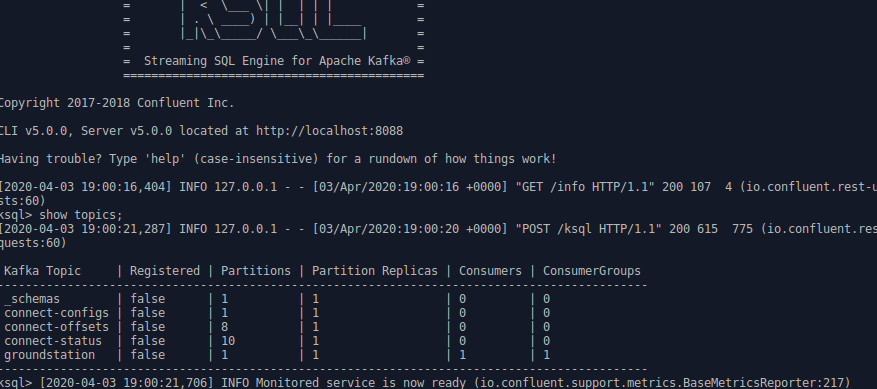](./images/ksql_topic.png)

Producer nodes listen for messages on incoming tcp port 7355, decode and send the message to the broker managed topic. Consumer worker nodes read those message off the topic and emit them via Cloudwatch Log Streaming to Elastic Search. 

  Cloudwatch Streaming to ElasticSearch and Kibana

In basic terms a cloudwatch agent was installed via userdata on the consumer-worker nodes to stream to a cloudformation configured loggroup and a Lambda function streams groups of messages to the ElasticSearch cluster. Reference can be found <a href="https://docs.aws.amazon.com/AmazonCloudWatch/latest/logs/CWL_ES_Stream.html">here.</a>

###

### Cost

This template will incur costs but it its minimal configuration and assuming you stop the receiver and processer m5.4xlarge intances ($0.768 per Hour each) and only run them in 15 minute increments the minimal cluster size would be composed of 3 instances with the following spot prices $0.20 per hour for Kafka worker nodes, $0.10 per hour for the Broker node. Minimal Elastic Search cluster costs as well which at the time of this writing t2.micro.elasticsearch $0.018 per Hour. 

[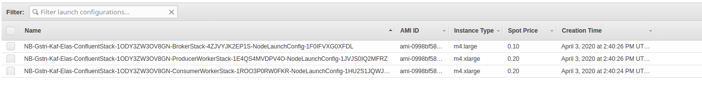](./images/price1.png)

###

### Results

Nasa splits their outputs into Level products. Level 0 products are closer to raw unprocessed data. As you rise to Levels 1 and 2 you start to see more human readable image and text output for example:

Here we see a couple of imags of AQUA's 4 minute fly over in range of the Ohio us-east-2 groundstation and pointing it's sensors towards the Atlantic Ocean. We can see the landmass around Nova Scotia as well as the cloudcover for that day. 

[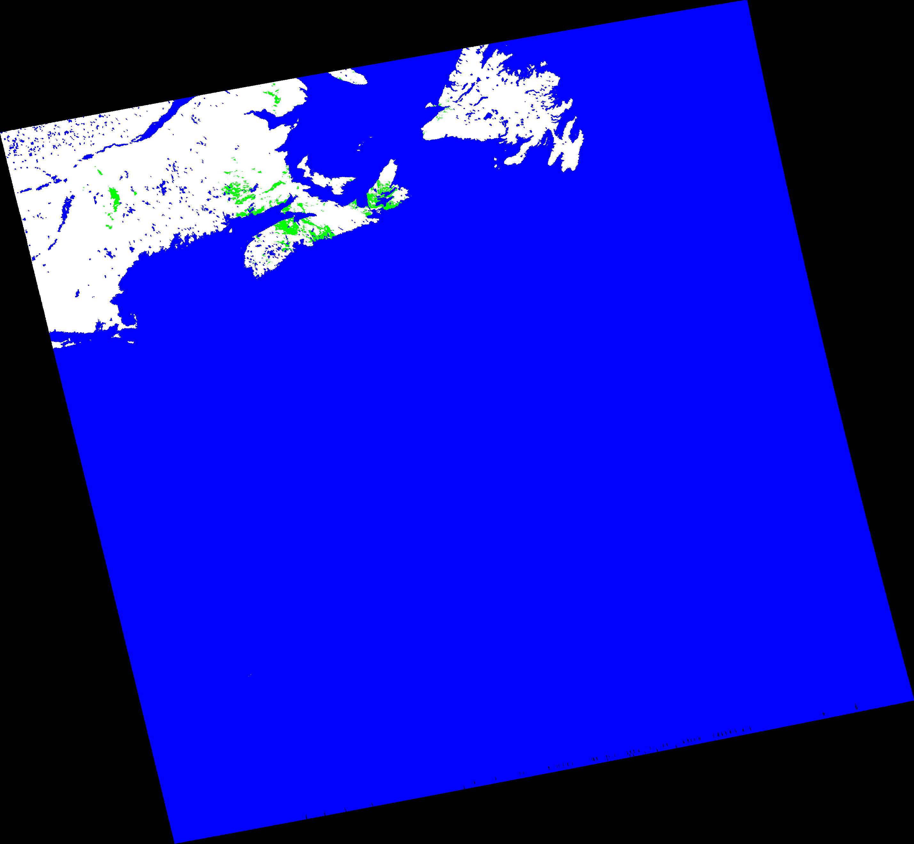](./images/MYD14.20090165802.png)

The AQUA satellite can be tracked live on the following site:

[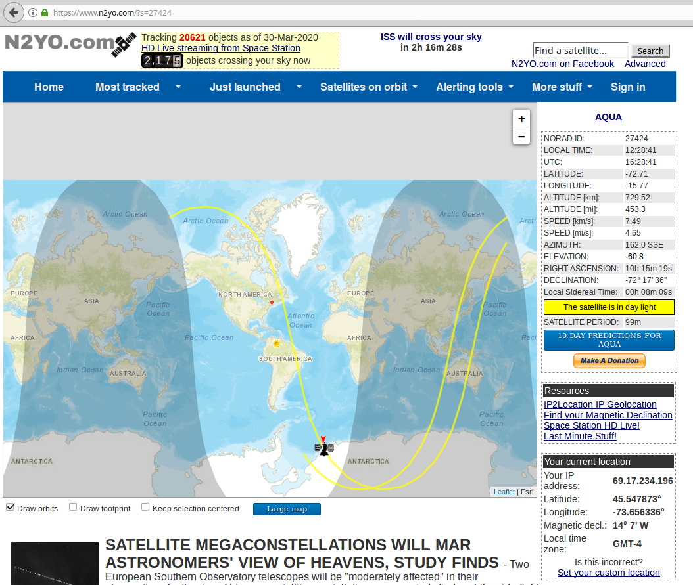](./images/aqua_live.png)

DataDefender 

The data stream can be monitored live on the DataDefender webgui. DataDefender is required to be running on the receiver instance communicating with the Ground Station antenna. 

[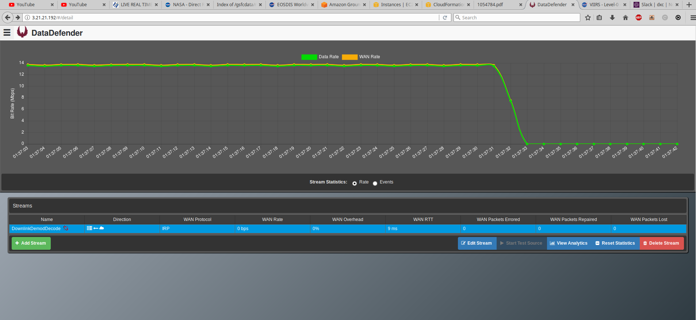](./images/contact.end.png)

The Data Rate

Kibana UI over Elastic Search

Here is an example of the Kibana UI showing received files with locations and decoded text messages indexed and searchable.

[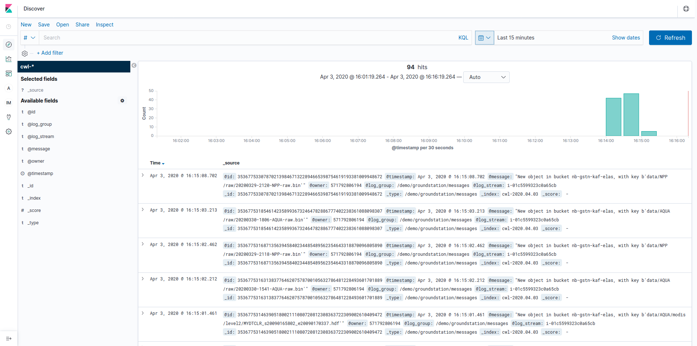](./images/kibana.png)

###

### Northbay Solutions

NorthBay works closely with customers to help rapidly
realize their goals using AWS services.

###

### Sam Zahabi

Sam is a Solutions Architect with NorthBay Solutions (NBS)
Professional Services. 

###

### Manoj Kukreja

Manoj is a Cloud Data Architect with NorthBay Solutions (NBS)
Professional Services. 

###

### Ritesh Kuchukulla

Ritesh is a Cloud Solutions Engineer with NorthBay Solutions (NBS)
Professional Services. 

###

### Resources

<a href="https://northbaysolutions.com/resources/" class="lb-txt-none lb-txt">NBS Resources</a>

<a href="https://aws.amazon.com/blogs/publicsector/earth-observation-using-aws-ground-station/">AWS Ground Station Blog</a>

<a href="https://docs.confluent.io/current/platform.html" class="lb-txt-none lb-txt">Confluent Platform</a>

<a href="https://aws.amazon.com/quickstart/architecture/confluent-platform/" class="lb-txt-none lb-txt">Confluent Kafka Quickstart</a>

<a href="https://aws.amazon.com/quickstart/architecture/vpc/" class="lb-txt-none lb-txt">VPC Quickstart</a>

<a href="https://docs.aws.amazon.com/AmazonCloudWatch/latest/logs/CWL_ES_Stream.html" class="lb-txt-none lb-txt">Elastic Search Cloudwatch Streaming</a>

------------------------------------------------------------------------

###

### Follow

<a href="https://twitter.com/northbays" class="lb-txt-none lb-txt"><em></em> NBS Twitter</a>

**

###