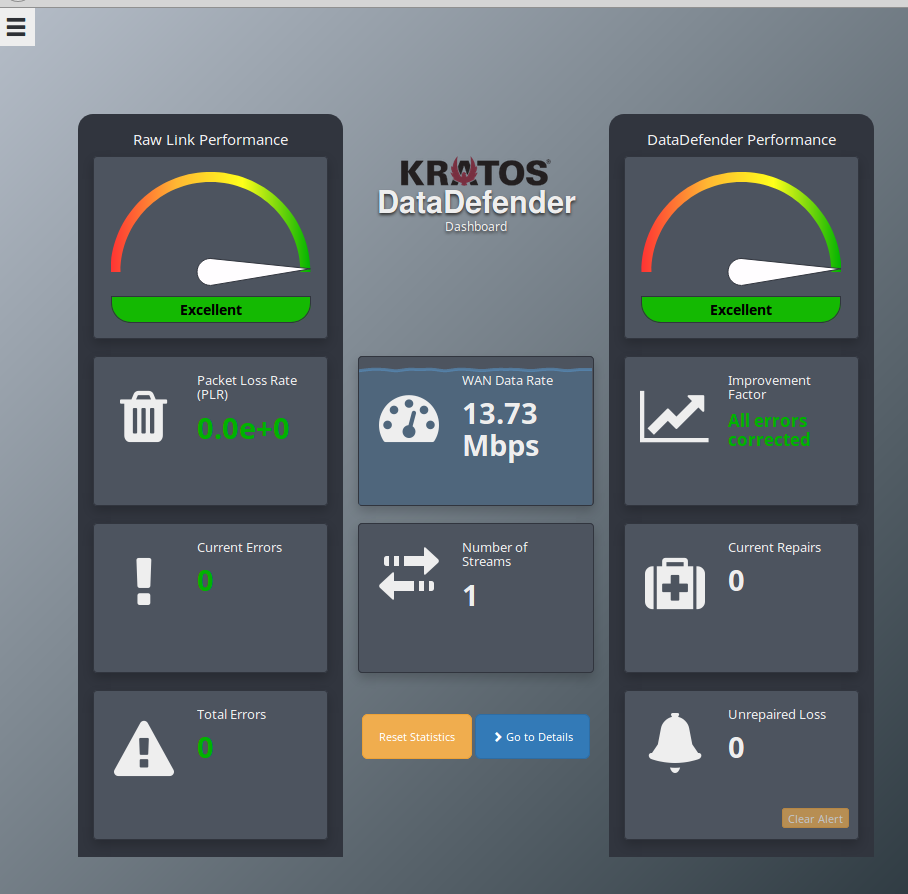

# northbay-gstn-kaf-elas
Cloudformation templates and scripts for a reference implementation of AWS Ground Station sending messages to a Kafka Cluster with Cloudwatch Streaming to ElasticSearch

[Northbay Blog](https://northbaysolutions.com/)
------------------------------------------------------------------------------------------

Bringing Space to the Cloud: Step by Step guide.
==========================================================

### High-level solution overview

Today we're going to be showing you how to combine 4 cloud technologies into a cloud native satellite radio transmission receiver that streams in a highly scalable way to a searchable index.

## Components

Northbay has created a Cloudformation Template that downloads data from AWS Ground Station into AWS Elasticsearch using Kafka. The pipeline was created using the following components:

  AWS Ground Station

  AWS VPC quickstart

  Apache Kafka

Using Confluent Community Edition helper functions and Cluster Quickstart.
Amazon Cloudwatch streaming to Elasticsearch and displaying in Kibana - 

  Cloudwatch Streaming to ElasticSearch and Kibana

###

### TLDR Step by Step 

This demo allows you to stream any sample radio communication as an input. However if you want to use real satellite transmissions you will need to first onboard your AWS in Ground Station and apply for downlink only (read only) access to Norad id 27424, [Aqua](https://en.wikipedia.org/wiki/Aqua_(satellite)) precipitation, evaporation and water cycling data gathering satellite. 

Steps:

1. Generate a us-east-2 keypair if you don't have one already. 

Bash

    aws ec2 create-key-pair --key-name my_key --region us-east-2 | jq -r .KeyMaterial > my_key.pem

2. Create a bucket in us-east-2 to store and run the required templates and software. 

Bash

    your_bucket=my_bucket
    aws s3 mb s3://$your_bucket --region us-east-2
    git clone https://github.com/Sam-NB/northbay-gstn-kaf-elas
    cd northbay-gstn-kaf-elas 
    aws s3 sync . s3://$your_bucket --exclude ".git*"

3. Fire off the one-click cloudformation deploy. (us-east-2). (Costs will be incurred on your account but spot instances can be used see below)

Bash

    # setup some required vars
    Env=demo
    region=us-east-2
    my_ip=$(curl "http://myexternalip.com/raw")
    url=$(aws s3 presign s3://$your_bucket/src/templates/northbay-kafka-groundstation-elasticsearch-master.template.yaml)
    
    # create the aws resources via cf stack
    aws cloudformation create-stack --stack-name NB-Gstn-Kaf-Elas \
    --template-url $url \
    --region $region \
    --capabilities CAPABILITY_NAMED_IAM CAPABILITY_IAM \
    --parameters \
    ParameterKey=AquaGroundStationCFTemplateVersion,ParameterValue=1 \
    ParameterKey=AquaGroundStationCreateReceiverInstance,ParameterValue=true \
    ParameterKey=AssignPublicIP,ParameterValue=true \
    ParameterKey=AvailabilityZones,ParameterValue="${region}a\,${region}b" \
    ParameterKey=BootDiskSize,ParameterValue=24 \
    ParameterKey=BrokerNodeInstanceType,ParameterValue=m4.large \
    ParameterKey=BrokerNodeSpotPrice,ParameterValue=0.05 \
    ParameterKey=BrokerNodeStorage,ParameterValue=40 \
    ParameterKey=BrokerNodeStorageType,ParameterValue=gp2 \
    ParameterKey=ClusterName,ParameterValue=kafka \
    ParameterKey=ConfluentEdition,ParameterValue="Confluent Open Source" \
    ParameterKey=ConfluentVersion,ParameterValue=5.0.0 \
    ParameterKey=ConnectorURLs,ParameterValue=- \
    ParameterKey=EBSIOPS,ParameterValue=0 \
    ParameterKey=EBSVolumeSize,ParameterValue=10 \
    ParameterKey=EBSVolumeType,ParameterValue=gp2 \
    ParameterKey=ElasticSearchInstanceCount,ParameterValue=1 \
    ParameterKey=ElasticSearchInstanceType,ParameterValue=t2.small.elasticsearch \
    ParameterKey=ElasticsearchVersion,ParameterValue=7.4 \
    ParameterKey=Env,ParameterValue=$Env \
    ParameterKey=GroundStationInstanceType,ParameterValue=m5.4xlarge \
    ParameterKey=GroundStationSatelliteName,ParameterValue=AQUA \
    ParameterKey=GroundstationMessageLogGroupName,ParameterValue=/$Env/groundstation/messages \
    ParameterKey=IpoppPassword,ParameterValue=ComplexPassword123 \
    ParameterKey=KafkaTopic,ParameterValue=groundstation \
    ParameterKey=KafkaTopicPartitions,ParameterValue=1 \
    ParameterKey=KafkaTopicReplicationFactor,ParameterValue=0 \
    ParameterKey=KeyPairName,ParameterValue=my_key \
    ParameterKey=LinuxOSAMI,ParameterValue=Amazon-Linux-HVM \
    ParameterKey=LogGroupName,ParameterValue=/dev/groundstation/messages \
    ParameterKey=NumBrokers,ParameterValue=1 \
    ParameterKey=NumConsumerWorkers,ParameterValue=1 \
    ParameterKey=NumProducerWorkers,ParameterValue=1 \
    ParameterKey=NumZookeepers,ParameterValue=0 \
    ParameterKey=PrivateSubnet1CIDR,ParameterValue=10.0.0.0/19 \
    ParameterKey=PrivateSubnet2CIDR,ParameterValue=10.0.32.0/19 \
    ParameterKey=PublicSubnet1CIDR,ParameterValue=10.0.128.0/20 \
    ParameterKey=PublicSubnet2CIDR,ParameterValue=10.0.144.0/20 \
    ParameterKey=QSS3BucketName,ParameterValue=$your_bucket \
    ParameterKey=QSS3KeyPrefix,ParameterValue=src/ \
    ParameterKey=RemoteAccessCIDR,ParameterValue=$my_ip/32 \
    ParameterKey=SSHAccessCIDR,ParameterValue=$my_ip/32 \
    ParameterKey=VPCCIDR,ParameterValue=10.0.0.0/16 \
    ParameterKey=WorkerNodeInstanceType,ParameterValue=m4.xlarge \
    ParameterKey=WorkerNodeSpotPrice,ParameterValue=0.10 \
    ParameterKey=WorkerNodeStorage,ParameterValue=0 \
    ParameterKey=ZookeeperNodeInstanceType,ParameterValue=m4.large \
    ParameterKey=ZookeeperNodeSpotPrice,ParameterValue=0.05 \
    ParameterKey=ZookeeperNodeStorage,ParameterValue=0

4. Wait for EC2 instance bootstrap userdata to execute approx (5 minutes)
5. Add Bucket Notifications to push processed Gstation files into the kafka topic.

Bash

    #some required vars
    your_account=$(aws sts get-caller-identity --output text --query 'Account')
    lambda=$(echo S3ToKafkaTopic_$Env)

    #add permissions and notifications on both the bucket and lambda function
    sed  "s/LAMBDA_FUNCTION/$lambda/g; s/REGION/$region/g; s/ACCOUNT_ID/$your_account/g" src/templates/event_sub.json  > sub.json
    aws lambda add-permission --function-name $lambda --statement-id lambda_invoker --action "lambda:InvokeFunction" --principal s3.amazonaws.com --source-arn "arn:aws:s3:::$your_bucket" --source-account $your_account --region $region
    aws s3api put-bucket-notification-configuration --bucket $your_bucket --notification-configuration file://sub.json

6. Send sample radio data to the open port on one of the the kafka producer nodes or Schedule a contact in the Groundstation UI.  

7. Manual mode

On our reference non groundstation SDR demodulator implementation, we have preconfigured multimon-ng a RTL-SDR compatible digital mode decoder that works on multiple protocols. For this example we are going to simulate receiving a tcp stream of Morse code in Continuous Wave. You can point your sdr to that port or use the sample file from wikipedia as below. The producer node will decode messages on received on tcp port 7355 and pipe those to our Kafka topic for ingestion and streaming to Elastic Search. 

Bash
    
    #download a sample Morse CW radio transmission
    wget https://upload.wikimedia.org/wikipedia/commons/0/04/Wikipedia-Morse.ogg
    ffmpeg -i Wikipedia-Morse.ogg -f s16le -acodec pcm_s16le Wikipedia-Morse.raw
    
    # what the raw file sounds like
    cat Wikipedia-Morse.raw | aplay -r 48k -f S16_LE -t raw -c 1

    # this is the decoding that happens on the producer node
    cat Wikipedia-Morse.raw | multimon-ng -a MORSE_CW -t raw -

    #test connectivity and simulate a transmission
    producer=$(aws ec2 describe-instances --region us-east-2 --output text |dos2unix| sed ':a;N;$!ba;s/\n/ /g' | sed "s/\(RESERVATIONS\)/\n\1/g" | grep kafka-producer | awk '{print $43}' | tail -n 1)
    nc -vz $producer 7355
    
    # transmit your tcp message to the producer node. 
    cat Wikipedia-Morse.raw | nc $producer 7355

In order to save costs while waiting for your scheduled satellite contact you can safely stop the receiver and processor instances and simply start them up 15 minutes before your receive window. After processing they can be safely stopped until you need them again next time. 

###

### Details of what happening in each piece

   The majority of the Kafka Stack configuration is done via the nodegroup.template.yaml userdata with custom bootstrap operations based node type BROKER, CONSUMER or PRODUCER.

Bash

    ZOOKER_PORT="2181"
    KAFKA_BROKER_PORT="9092"
    ZOOKEEPER_SERVERS=""
    KAFKA_BROKER_SERVERS=""
    read -ra brokerips <<< $(cat /tmp/brokers | cut -d' ' -f1)

    for brokerip in "${brokerips[@]}"; do
      KAFKA_BROKER_SERVERS="${brokerip}:${KAFKA_BROKER_PORT} ${KAFKA_BROKER_SERVERS}"
    done

    read -ra zookerips <<< $(cat /tmp/zookeepers | cut -d' ' -f1)
    for zookeeperip in "${zookerips[@]}"; do
      ZOOKEEPER_SERVERS="${zookeeperip}:${ZOOKER_PORT} ${ZOOKEEPER_SERVERS}"
    done

    KAFKATOPIC_REPLICATIONFACTOR=1
    KAFKATOPIC_PARTITIONS=1
    KAFKA_TOPIC=groundstation
    WORKER_TYPE=consumer-worker
    LOG_GROUP_NAME=/demo/groundstation/messages
    Env=demo
    region=us-east-2
    /opt/confluent-5.0.0/bin/kafka-topics --if-not-exists --create --zookeeper $ZOOKEEPER_SERVERS --replication-factor "$KAFKATOPIC_REPLICATIONFACTOR" --partitions "$KAFKATOPIC_PARTITIONS" --topic "$KAFKA_TOPIC"

    if [ "$WORKER_TYPE" = "consumer-worker" ] ; then 
      wget https://s3.amazonaws.com/amazoncloudwatch-agent/amazon_linux/amd64/latest/amazon-cloudwatch-agent.rpm
      rpm -U ./amazon-cloudwatch-agent.rpm
      echo '{
      "agent": {
              "run_as_user": "cwagent"
                },
      "logs": {
              "logs_collected": {
                      "files": {
                              "collect_list": [
                                      {
                                              "file_path": "/var/log/groundstation.log",
                                              "log_group_name": "'$LOG_GROUP_NAME'",
                                              "log_stream_name": "{instance_id}"
                                      }
                                              ]
                                }
                                }
              }
    }' > /opt/aws/amazon-cloudwatch-agent/etc/amazon-cloudwatch-agent.json
      /opt/aws/amazon-cloudwatch-agent/bin/amazon-cloudwatch-agent-ctl -a fetch-config -m ec2 -c file:/opt/aws/amazon-cloudwatch-agent/etc/amazon-cloudwatch-agent.json -s
      echo "/opt/aws/amazon-cloudwatch-agent/logs/amazon-cloudwatch-agent.log {
        missingok
        notifempty
        rotate 10
        daily
        compress
        }" > /etc/logrotate.d/cloudwatch-agent
      /opt/confluent-5.0.0/bin/kafka-console-consumer --bootstrap-server "$KAFKA_BROKER_SERVERS" --topic "$KAFKA_TOPIC" >> /var/log/groundstation.log
    fi

    if [ "$WORKER_TYPE" = "producer-worker" ] ; then 
      sudo yum update -y
      sudo yum groupinstall "Development Tools" -y
      sudo yum install git cmake -y
      git clone https://github.com/EliasOenal/multimon-ng
      cd multimon-ng/
      mkdir build
      cd build/
      cmake ..
      make
      sudo make install
      cd ~
      while true; do sudo nc -l 7355 | multimon-ng -a MORSE_CW -t raw - | sudo /opt/confluent-5.0.0/bin/kafka-console-producer --broker-list $KAFKA_BROKER_SERVERS --topic $KAFKA_TOPIC; done &
    fi

    if [ "$WORKER_TYPE" = "broker" ] ; then
      aws ssm put-parameter --name "/${Env}/bootstrap_servers" --value "$KAFKA_BROKER_SERVERS" --type "String" --description "list of brokers" --overwrite --region "$region"
      aws ssm put-parameter --name "/${Env}/topic" --value "$KAFKA_TOPIC" --type "String" --description "Kafka topic" --overwrite --region "$region"
    fi

  AWS Ground Station

For this piece we followed the extensive guide provide by aws and merged it into our cloudformation template with all scripts and required software included for ease of one-click deploy. <a href="https://aws.amazon.com/blogs/publicsector/earth-observation-using-aws-ground-station/">AWS Ground Station Blog</a>

  AWS VPC quickstart

Here we have configured a basic high-availability setup using 2 zones us-east-2a and us-east2-b that the cluster instances would scale into if you raised the number of required nodes. In this demo we only used 1 node in each availability group but this can be scaled up. 

  Apache Kafka

We used a 3 stack approach. We have a broker cluster that hosts the Kafka broker topics and Zookeeper nodes, a consumer cluster

Communication is managed over the groundstation topic. 

Producer nodes listen for messages on incoming tcp port 7355, decode and send the message to the broker managed topic. Consumer worker nodes read those message off the topic and emit them via Cloudwatch Log Streaming to Elastic Search. 

  Cloudwatch Streaming to ElasticSearch and Kibana

In basic terms a cloudwatch agent was installed via userdata on the consumer-worker nodes to stream to a cloudformation configured loggroup and a Lambda function streams groups of messages to the ElasticSearch cluster. Reference can be found <a href="https://docs.aws.amazon.com/AmazonCloudWatch/latest/logs/CWL_ES_Stream.html">here.</a>

###

### Cost

This template will incur costs but it its minimal configuration and assuming you stop the receiver and processer m5.4xlarge intances ($0.768 per Hour each) and only run them in 15 minute increments the minimal cluster size would be composed of 3 instances with the following spot prices $0.20 per hour for Kafka worker nodes, $0.10 per hour for the Broker node. Minimal Elastic Search cluster costs as well which at the time of this writing t2.micro.elasticsearch $0.018 per Hour. 

###

### Results

Nasa splits their outputs into Level products. Level 0 products are closer to raw unprocessed data. As you rise to Levels 1 and 2 you start to see more human readable image and text output for example:

The AQUA satellite can be tracked live on the following site:

DataDefender 

The data stream can be monitored live on the DataDefender webgui. DataDefender is required to be running on the receiver instance communicating with the Ground Station antenna. 

The Data Rate

Kibana UI over Elastic Search

Here is an example of the Kibana UI showing received files with locations and decoded text messages indexed and searchable.

###

### Sam Zahabi

Sam is a Solutions Architect with NorthBay Solutions (NBS)
Professional Services. NorthBay works closely with customers to help rapidly
realize their goals using AWS services.

###

### Manoj Kukreja

Manoj is a Cloud Data Architect with NorthBay Solutions (NBS)
Professional Services. NorthBay works closely with customers to help rapidly
realize their goals using AWS services.

###

### Ritesh Kuchukulla

Ritesh is a Cloud Solutions Engineer with NorthBay Solutions (NBS)
Professional Services. NorthBay works closely with customers to help rapidly
realize their goals using AWS services.

###

### Resources

<a href="https://northbaysolutions.com/resources/" class="lb-txt-none lb-txt">NBS Resources</a>

<a href="https://aws.amazon.com/blogs/publicsector/earth-observation-using-aws-ground-station/">AWS Ground Station Blog</a>

<a href="https://aws.amazon.com/quickstart/architecture/confluent-platform/" class="lb-txt-none lb-txt">Confluent Kafka Quickstart</a>

<a href="https://aws.amazon.com/quickstart/architecture/vpc/" class="lb-txt-none lb-txt">VPC Quickstart</a>

<a href="https://docs.aws.amazon.com/AmazonCloudWatch/latest/logs/CWL_ES_Stream.html" class="lb-txt-none lb-txt">Elastic Search Cloudwatch Streaming</a>

------------------------------------------------------------------------

###

### Follow

<a href="https://twitter.com/northbays" class="lb-txt-none lb-txt"><em></em> NBS Twitter</a>

**

###