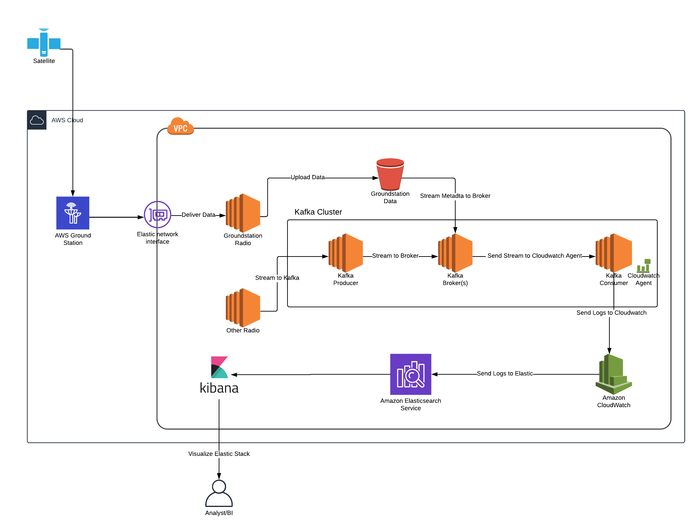
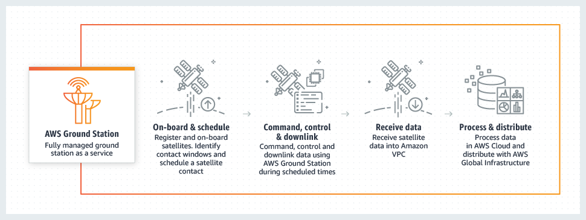
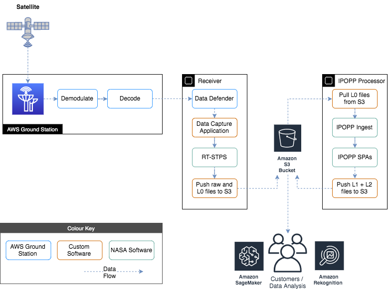
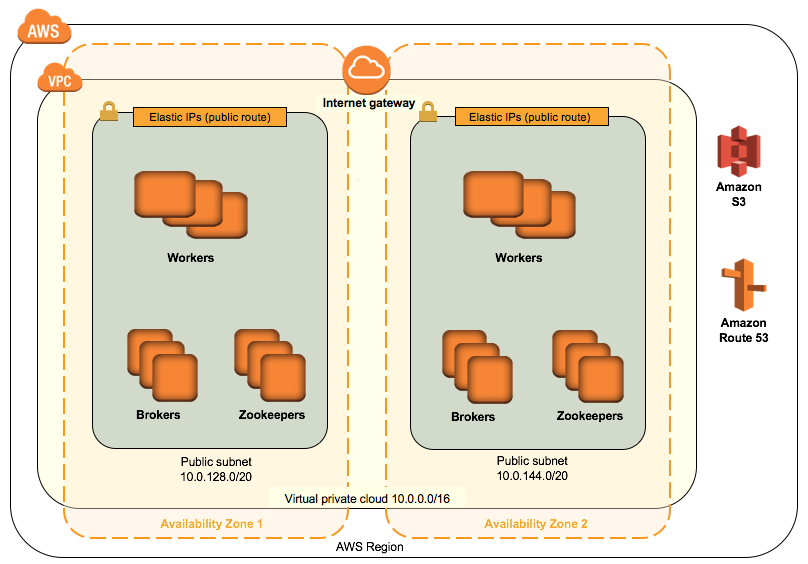
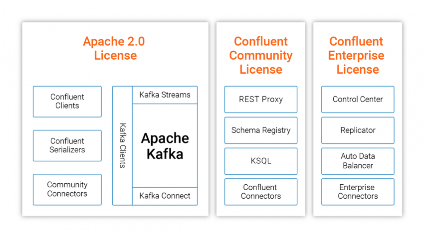
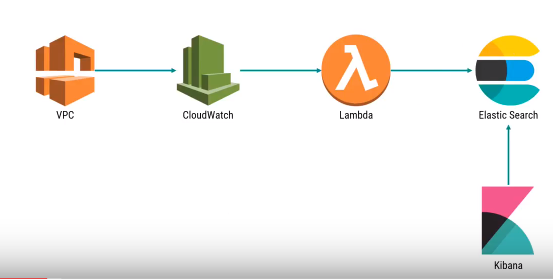
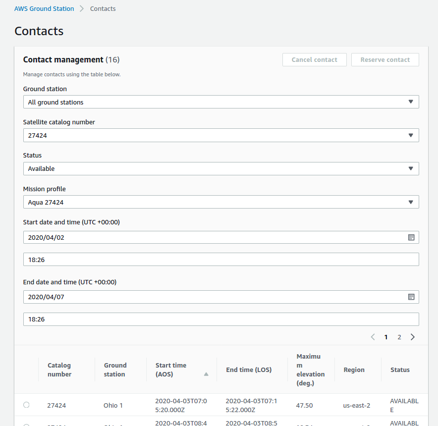

# northbay-gstn-kaf-elas
Cloudformation templates and scripts for a reference implementation of AWS Ground Station sending messages to a Kafka Cluster with Cloudwatch Streaming to ElasticSearch

[Northbay Blog](https://northbaysolutions.com/)
------------------------------------------------------------------------------------------

Bringing Space to the Cloud: A how to guide
==========================================================

### High-level solution overview

Today we're going to be showing you how to combine 4 cloud technologies into a cloud native satellite radio transmission receiver that streams in a highly scalable way to a searchable index.

## Components

Northbay has created a Cloudformation Template that downloads data from AWS Ground Station into AWS Elasticsearch using Kafka. The pipeline was created using the following components:

  AWS Ground Station

  AWS VPC quickstart

  Apache Kafka

Using Confluent Community Edition helper functions and Cluster Quickstart.
Amazon Cloudwatch streaming to Elasticsearch and displaying in Kibana - 

  Cloudwatch Streaming to ElasticSearch and Kibana

###

### TLDR Step by Step 

This demo allows you to stream any sample radio communication as an input. However if you want to use real satellite transmissions you will need to first onboard your AWS in Ground Station and apply for downlink only (read only) access to Norad id 27424, [Aqua](https://en.wikipedia.org/wiki/Aqua_(satellite)) precipitation, evaporation and water cycling data gathering satellite. 

Steps:

1. Generate a us-east-2 keypair if you don't have one already. 

Bash

    aws ec2 create-key-pair --key-name my_key --region us-east-2 | jq -r .KeyMaterial > my_key.pem

2. Create a bucket in us-east-2 to store and run the required templates and software. 

Bash

    your_bucket=my_bucket
    aws s3 mb s3://$your_bucket --region us-east-2
    git clone https://github.com/Sam-NB/northbay-gstn-kaf-elas
    cd northbay-gstn-kaf-elas 
    aws s3 sync . s3://$your_bucket --exclude ".git*"

3. Fire off the one-click cloudformation deploy. (us-east-2). (Costs will be incurred on your account but spot instances can be used see below)
Bash

    # setup some required vars
    Env=demo
    region=us-east-2
    my_ip=curl "http://myexternalip.com/raw"
    url=$(aws s3 presign s3://$your_bucket/src/templates/northbay-kafka-groundstation-elasticsearch-master.template.yaml)
    
    # create the aws resources via cf stack
    aws cloudformation create-stack --stack-name NB-Gstn-Kaf-Elas \
    --template-url $url \
    --region $region \
    --capabilities CAPABILITY_NAMED_IAM CAPABILITY_IAM \
    --parameters \
    ParameterKey=AquaGroundStationCFTemplateVersion,ParameterValue=1 \
    ParameterKey=AquaGroundStationCreateReceiverInstance,ParameterValue=true \
    ParameterKey=AssignPublicIP,ParameterValue=true \
    ParameterKey=AvailabilityZones,ParameterValue="${region}a\,${region}b" \
    ParameterKey=BootDiskSize,ParameterValue=24 \
    ParameterKey=BrokerNodeInstanceType,ParameterValue=m4.large \
    ParameterKey=BrokerNodeSpotPrice,ParameterValue=0.05 \
    ParameterKey=BrokerNodeStorage,ParameterValue=40 \
    ParameterKey=BrokerNodeStorageType,ParameterValue=gp2 \
    ParameterKey=ClusterName,ParameterValue=kafka \
    ParameterKey=ConfluentEdition,ParameterValue="Confluent Open Source" \
    ParameterKey=ConfluentVersion,ParameterValue=5.0.0 \
    ParameterKey=ConnectorURLs,ParameterValue=- \
    ParameterKey=EBSIOPS,ParameterValue=0 \
    ParameterKey=EBSVolumeSize,ParameterValue=10 \
    ParameterKey=EBSVolumeType,ParameterValue=gp2 \
    ParameterKey=ElasticSearchInstanceCount,ParameterValue=1 \
    ParameterKey=ElasticSearchInstanceType,ParameterValue=t2.small.elasticsearch \
    ParameterKey=ElasticsearchVersion,ParameterValue=7.4 \
    ParameterKey=Env,ParameterValue=$Env \
    ParameterKey=GroundStationInstanceType,ParameterValue=m5.4xlarge \
    ParameterKey=GroundStationSatelliteName,ParameterValue=AQUA \
    ParameterKey=GroundstationMessageLogGroupName,ParameterValue=/$Env/groundstation/messages \
    ParameterKey=IpoppPassword,ParameterValue=ComplexPassword123 \
    ParameterKey=KafkaTopic,ParameterValue=groundstation \
    ParameterKey=KafkaTopicPartitions,ParameterValue=1 \
    ParameterKey=KafkaTopicReplicationFactor,ParameterValue=0 \
    ParameterKey=KeyPairName,ParameterValue=my_key \
    ParameterKey=LinuxOSAMI,ParameterValue=Amazon-Linux-HVM \
    ParameterKey=LogGroupName,ParameterValue=/dev/groundstation/messages \
    ParameterKey=NumBrokers,ParameterValue=1 \
    ParameterKey=NumConsumerWorkers,ParameterValue=1 \
    ParameterKey=NumProducerWorkers,ParameterValue=1 \
    ParameterKey=NumZookeepers,ParameterValue=0 \
    ParameterKey=PrivateSubnet1CIDR,ParameterValue=10.0.0.0/19 \
    ParameterKey=PrivateSubnet2CIDR,ParameterValue=10.0.32.0/19 \
    ParameterKey=PublicSubnet1CIDR,ParameterValue=10.0.128.0/20 \
    ParameterKey=PublicSubnet2CIDR,ParameterValue=10.0.144.0/20 \
    ParameterKey=QSS3BucketName,ParameterValue=$your_bucket \
    ParameterKey=QSS3KeyPrefix,ParameterValue=src/ \
    ParameterKey=RemoteAccessCIDR,ParameterValue=$my_ip/32 \
    ParameterKey=SSHAccessCIDR,ParameterValue=$my_ip/32 \
    ParameterKey=VPCCIDR,ParameterValue=10.0.0.0/16 \
    ParameterKey=WorkerNodeInstanceType,ParameterValue=t3.micro \
    ParameterKey=WorkerNodeSpotPrice,ParameterValue=0.02 \
    ParameterKey=WorkerNodeStorage,ParameterValue=0 \
    ParameterKey=ZookeeperNodeInstanceType,ParameterValue=m4.large \
    ParameterKey=ZookeeperNodeSpotPrice,ParameterValue=0.05 \
    ParameterKey=ZookeeperNodeStorage,ParameterValue=0

4. Wait for EC2 instance bootstrap userdata to execute approx (5 minutes)
5. Add Bucket Notifications to push processed Gstation files into the kafka topic.

Bash

    #some required vars
    your_account=$(aws sts get-caller-identity --output text --query 'Account')
    lambda=$(echo S3ToKafkaTopic_$Env)

    #add permissions and notifications on both the bucket and lambda function
    sed  "s/LAMBDA_FUNCTION/$lambda/g; s/REGION/$region/g; s/ACCOUNT_ID/$your_account/g" src/templates/event_sub.json  > sub.json
    aws lambda add-permission --function-name $lambda --statement-id lambda_invoker --action "lambda:InvokeFunction" --principal s3.amazonaws.com --source-arn "arn:aws:s3:::$your_bucket" --source-account $your_account --region $region
    aws s3api put-bucket-notification-configuration --bucket $your_account --notification-configuration file://sub.json

6. Send sample radio data to the open port on one of the the kafka producer nodes or Schedule a contact in the Groundstation UI.  

7. Manual mode

Bash
    
    #download a sample Morse CW radio transmission
    wget https://upload.wikimedia.org/wikipedia/commons/9/9e/A_through_Z_in_Morse_code.ogg
    ffmpeg -i A_through_Z_in_Morse_code.ogg -f s16le -acodec pcm_s16le A_through_Z_in_Morse_code.raw
    
    #test connectivity and simulate a transmission
    producer=$(aws ec2 describe-instances --region us-east-2 --output text |dos2unix| sed ':a;N;$!ba;s/\n/ /g' | sed "s/\(RESERVATIONS\)/\n\1/g" | grep kafka-producer | awk '{print $43}')
    nc -vz $producer 7355 -u

    cat A_through_Z_in_Morse_code.raw | multimon-ng -a MORSE_CW -t raw -
    cat A_through_Z_in_Morse_code.raw | aplay -r 48k -f S16_LE -t raw -c 1
    cat A_through_Z_in_Morse_code.raw | nc $producer 7355 -u

In order to save costs while waiting for your scheduled satellite contact you can safely stop the receiver and processor instances and simply start them up 15 minutes before your receive window. After processing they can be safely stopped until you need them again next time. 

###

### Details of what happening in each step

###

AWS Ground Station

Before you start using AWS Ground Station you will need to complete the registration for your AWS Ground Station account. See the Satellites and Resources section in the AWS Ground Station console page for onboarding details.  

Once you have completed the onboarding steps you may proceed with the following steps:

Apache Kafka - Confluent Platform on the AWS Cloud
We used the Confluent Platform for streaming in a  large-scale distributed environment built on Apache Kafka. The Confluent Platform on AWS Quick Start is for users who are looking to evaluate and use the full range of Confluent Platform and Apache Kafka capabilities in the managed infrastructure environment of AWS. 
This Quick Start deploys Confluent Platform using AWS CloudFormation templates. You can use the Quick Start to build a new virtual private cloud (VPC) for your Confluent Platform cluster, or deploy Confluent Platform into an existing VPC.
We created a Kafka Cluster using the following configurations:
 
Broker Node Instance Type:        m4.large (1)
Producer Node Instance Type:    m4.xlarge (1)
Consumer Node Instance Type:    m4.xlarge (1)
Confluent Edition:            Confluent Open Source
Topic:                    groundstation
 

groundstation-broker-0 - Kafka Broker stores messages for Kafka topic groundstation
groundstation-producer-0 - Reads data from radio and sends messages to Kafka topic groundstation
groundstation-consumer-0 - Reads messages from Kafka topic groundstation and spools to a local file groundstation.log
Amazon Cloudwatch
We used Amazon Cloudwatch to collect messages from Kafka because the service has inbuilt functionality to stream data that it receives to Amazon Elasticsearch Service in near real-time through a CloudWatch Logs subscription. 

To accomplish this we configured an Amazon Cloudwatch Agent on the Kafka consumer and set up a subscription on the Amazon Cloudwatch Log Group to send messages to Amazon Elasticsearch service using Lambda.
Amazon Cloudwatch Agent Configuration
An Amazon Cloudwatch Agent is configured on the Kafka Consumer (groundstation-consumer-0) which collects the messages in groundstation.log and transfers them to Amazon Cloudwatch.

log-config.json
{
 "version":"1",
 "log_configs":[{"log_group_name":"/dxc/dev/groundstation/messages"}],
 "Region":"us-east-2"
}

amazon-cloudwatch-agent.toml
[agent]
  collection_jitter = "0s"
  debug = false
  flush_interval = "1s"
  flush_jitter = "0s"
  hostname = ""
  interval = "60s"
  logfile = "/opt/aws/amazon-cloudwatch-agent/logs/amazon-cloudwatch-agent.log"
  metric_batch_size = 1000
  metric_buffer_limit = 10000
  omit_hostname = false
  precision = ""
  quiet = false
  round_interval = false

[inputs]

  [[inputs.tail]]
    data_format = "value"
    data_type = "string"
    file_state_folder = "/opt/aws/amazon-cloudwatch-agent/logs/state"
    name_override = "raw_log_line"

    [[inputs.tail.file_config]]
      file_path = "/var/log/groundstation.log"
      from_beginning = true
      log_group_name = "/dxc/dev/groundstation/messages"
      log_stream_name = "i-02728618e6211bd5a"
      pipe = false
    [inputs.tail.tags]
      metricPath = "logs"

[outputs]

  [[outputs.cloudwatchlogs]]
    file_state_folder = "/opt/aws/amazon-cloudwatch-agent/logs/state"
    force_flush_interval = "5s"
    log_stream_name = "i-02728618e6211bd5a"
    region = "us-east-2"
    tagexclude = ["metricPath"]
    [outputs.cloudwatchlogs.tagpass]
      metricPath = ["logs"]

[AWS Government, Education, & Nonprofits Blog](https://aws.amazon.com/blogs/publicsector/)
------------------------------------------------------------------------------------------

Earth observation using AWS Ground Station: A how to guide
==========================================================

by Nicholas Ansell | on 24 MAR 2020 | in [AWS Ground
Station](https://aws.amazon.com/blogs/publicsector/category/satellite/aws-ground-station/ "View all posts in AWS Ground Station"),
[Government](https://aws.amazon.com/blogs/publicsector/category/public-sector/government/ "View all posts in Government"),
[Nonprofit](https://aws.amazon.com/blogs/publicsector/category/public-sector/nonprofit/ "View all posts in Nonprofit"),
[Public
Sector](https://aws.amazon.com/blogs/publicsector/category/public-sector/ "View all posts in Public Sector"),
[Satellite](https://aws.amazon.com/blogs/publicsector/category/satellite/ "View all posts in Satellite"),
[Technical
How-to](https://aws.amazon.com/blogs/publicsector/category/post-types/technical-how-to/ "View all posts in Technical How-to")
|
[Permalink](https://aws.amazon.com/blogs/publicsector/earth-observation-using-aws-ground-station/)
|
<a href="https://commenting.awsblogs.com/embed.html?disqus_shortname=aws-publicsector-blog&amp;disqus_identifier=6189&amp;disqus_title=Earth+observation+using+AWS+Ground+Station%3A+A+how+to+guide&amp;disqus_url=https://aws.amazon.com/blogs/publicsector/earth-observation-using-aws-ground-station/" id="aws-comment-trigger-6189"><em></em> Comments</a>
| [ Share](https://aws.amazon.com/blogs/publicsector/earth-observation-using-aws-ground-station/#)
-   <a href="https://www.facebook.com/sharer/sharer.php?u=https://aws.amazon.com/blogs/publicsector/earth-observation-using-aws-ground-station/" class="lb-txt"></a>
-   <a href="https://twitter.com/intent/tweet/?text=Earth%20observation%20using%20AWS%20Ground%20Station%3A%20A%20how%20to%20guide&amp;via=awscloud&amp;url=https://aws.amazon.com/blogs/publicsector/earth-observation-using-aws-ground-station/" class="lb-txt"></a>
-   <a href="https://www.linkedin.com/shareArticle?mini=true&amp;title=Earth%20observation%20using%20AWS%20Ground%20Station%3A%20A%20how%20to%20guide&amp;source=Amazon%20Web%20Services&amp;summary=Over%20the%20past%20decade%2C%20a%20crop%20of%20new%20companies%20focused%20on%20Earth%20observation%20%28EO%29%20have%20made%20valuable%20EO%20data%20more%20accessible%20to%20a%20broad%20audience%20than%20before.%20As%20a%20result%2C%20we%20are%20seeing%20a%20dramatic%20increase%20in%20EO%20science.%20The%20value%20of%20EO%20data%20is%20the%20ability%20to%20monitor%20change.%20Recently%2C%20new%20instrumentation%20aboard%20satellites%20such%20as%20radar%20now%20allow%20us%20to%20%E2%80%9Csee%E2%80%9D%20through%20clouds%2C%20allowing%20observation%20of%20any%20part%20of%20the%20Earth.%20The%20reliable%2C%20repeatable%2C%20and%20accurate%20data%20now%20flowing%20from%20satellites%20is%20opening%20up%20the%20reality%20of%20operational%20services%20powered%20by%20satellite%20imagery.%20Learn%20how%20to%20get%20started%20with%20EO%20data%20using%20AWS%20Ground%20Station.&amp;url=https://aws.amazon.com/blogs/publicsector/earth-observation-using-aws-ground-station/" class="lb-txt"></a>
-   <noscript>&#60;&#x73;&#112;&#x61;&#110;&#32;&#x63;&#108;&#x61;&#x73;&#x73;&#x3d;&#34;&#x69;&#x63;&#x6f;&#110;&#x2d;&#x65;&#110;&#118;&#x65;&#108;&#x6f;&#112;&#x65;&#x2d;&#x73;&#x71;&#x75;&#x61;&#114;&#x65;&#34;&#32;&#x61;&#114;&#x69;&#x61;&#x2d;&#108;&#x61;&#98;&#x65;&#108;&#x3d;&#34;&#x53;&#104;&#x61;&#114;&#x65;&#32;&#x6f;&#110;&#32;&#x45;&#x6d;&#x61;&#x69;&#108;&#34;&#62;&#60;&#x2f;&#x73;&#112;&#x61;&#110;&#62;&#32;&#40;&#x3f;&#x73;&#x75;&#98;&#106;&#x65;&#x63;&#116;&#x3d;&#x45;&#x61;&#114;&#116;&#104;&#x25;&#50;&#48;&#x6f;&#98;&#x73;&#x65;&#114;&#118;&#x61;&#116;&#x69;&#x6f;&#110;&#x25;&#50;&#48;&#x75;&#x73;&#x69;&#110;&#x67;&#x25;&#50;&#48;&#x41;&#x57;&#x53;&#x25;&#50;&#48;&#x47;&#114;&#x6f;&#x75;&#110;&#100;&#x25;&#50;&#48;&#x53;&#116;&#x61;&#116;&#x69;&#x6f;&#110;&#x25;&#x33;&#x41;&#x25;&#50;&#48;&#x41;&#x25;&#50;&#48;&#104;&#x6f;&#x77;&#x25;&#50;&#48;&#116;&#x6f;&#x25;&#50;&#48;&#x67;&#x75;&#x69;&#100;&#x65;&#38;&#98;&#x6f;&#100;&#x79;&#x3d;&#x45;&#x61;&#114;&#116;&#104;&#x25;&#50;&#48;&#x6f;&#98;&#x73;&#x65;&#114;&#118;&#x61;&#116;&#x69;&#x6f;&#110;&#x25;&#50;&#48;&#x75;&#x73;&#x69;&#110;&#x67;&#x25;&#50;&#48;&#x41;&#x57;&#x53;&#x25;&#50;&#48;&#x47;&#114;&#x6f;&#x75;&#110;&#100;&#x25;&#50;&#48;&#x53;&#116;&#x61;&#116;&#x69;&#x6f;&#110;&#x25;&#x33;&#x41;&#x25;&#50;&#48;&#x41;&#x25;&#50;&#48;&#104;&#x6f;&#x77;&#x25;&#50;&#48;&#116;&#x6f;&#x25;&#50;&#48;&#x67;&#x75;&#x69;&#100;&#x65;&#x25;&#48;&#x41;&#x25;&#48;&#x41;&#104;&#116;&#116;&#112;&#x73;&#58;&#x2f;&#x2f;&#x61;&#x77;&#x73;&#46;&#x61;&#x6d;&#x61;&#122;&#x6f;&#110;&#46;&#x63;&#x6f;&#x6d;&#x2f;&#98;&#108;&#x6f;&#x67;&#x73;&#x2f;&#112;&#x75;&#98;&#108;&#x69;&#x63;&#x73;&#x65;&#x63;&#116;&#x6f;&#114;&#x2f;&#x65;&#x61;&#114;&#116;&#104;&#x2d;&#x6f;&#98;&#x73;&#x65;&#114;&#118;&#x61;&#116;&#x69;&#x6f;&#110;&#x2d;&#x75;&#x73;&#x69;&#110;&#x67;&#x2d;&#x61;&#x77;&#x73;&#x2d;&#x67;&#114;&#x6f;&#x75;&#110;&#100;&#x2d;&#x73;&#116;&#x61;&#116;&#x69;&#x6f;&#110;&#x2f;&#32;&#x61;&#116;&#32;&#x29;</noscript>
-   

We live in an information society where access to data helps drive our
decision and behaviors. For example, recent satellite images from NASA
showing the melting of the ice cap on Eagle Island in Antarctica and its
impact on wildlife is powerful. It highlights the need to protect
endangered species.

Over the past decade, a crop of new companies focused on Earth
observation (EO) have made [valuable EO data more accessible to a broad
audience than
before](https://aws.amazon.com/blogs/publicsector/true-value-earth-observation-data/).
As a result, we are seeing a dramatic increase in EO science.

The value of EO data is the ability to monitor change. Recently, new
instrumentation aboard satellites such as radar now allow us to “see”
through clouds, allowing observation of any part of the Earth. The
reliable, repeatable, and accurate data now flowing from satellites is
opening up the reality of operational services powered by satellite
imagery.

As the space race to launch a fleet of small low earth orbit (LEOs)
satellites heats up, technological developments such as smaller
satellites and the re-use of launch vehicles has driven down the cost of
building and launching satellites. If you are within a satellite
footprint and need to lease transponder capacity on an ad-hoc basis or
do not want to invest in costly satellite ground segment infrastructure,
consider AWS Ground Station.

[AWS Ground Station](https://aws.amazon.com/ground-station/) is a fully
managed, pay-per-use service that lets you communicate with  satellites
without having to buy, lease, build, or maintain your own satellite
ground stations. If are considering using EO data for a startup idea or
scientific endeavor, this blog post explains how to use AWS Ground
Station to receive and process data from earth observation satellites.
With the solution proposed in this post, you will have usable data in
your [Amazon Simple Storage Service (Amazon
S3)](https://aws.amazon.com/s3/) bucket within a few minutes of
successful satellite contact.

Global change monitoring is a reality and AWS Ground Station increases
the speed of data access while reducing the cost of data connection.
Data received using AWS Ground Station can be further processed using
AWS global infrastructure including low-cost storage and web publishing
with Amazon S3, real-time streaming using [Amazon
Kinesis](https://aws.amazon.com/kinesis/), or machine learning with
[Amazon SageMaker](https://aws.amazon.com/sagemaker/).

### 

### High-level solution overview

In this blog post, I receive and process data from the AQUA satellite
whose location can be tracked in real-time using [this
link](https://celestrak.com/cesium/orbit-viz.php?tle=/satcat/tle.php?CATNR=27424&satcat=/pub/satcat.txt&orbits=1&pixelSize=3&samplesPerPeriod=90).
AQUA launched in 2002 and is part of NASA’s Earth Science Data Systems
(ESDS) program. It orbits the Earth in a Sun-synchronous near-polar
orbit at an altitude of 705km, which makes it a LEO (Low Earth Orbit)
satellite. AQUA has five active sensing instruments. The ESDS program
plays a vital role in the development of validated, global, and
interactive Earth system models able to predict global change
accurately.

AWS Ground Station currently supports LEO and MEO (Medium Earth Orbit)
satellites. Because of their orbital periods, these satellites are
visible from the ground only for a few minutes during each pass, and
communication is only possible when they are within line of sight of a
ground station. AWS Ground Station establishes contact with the
satellites, and then receives, demodulates, and decodes its
radiofrequency signals. It then pushes the decoded data to the receiver
[Amazon Elastic Compute Cloud (Amazon EC2)](https://aws.amazon.com/ec2/)
instance as a VITA 49 stream.

A data capture application running on the receiver EC2 instance ingests
the incoming VITA49 stream. The payload from within each VITA49 packet
is extracted and combined into a raw data file. The raw data file is
held locally and also pushed to Amazon S3 to be reprocessed as needed at
a later date.

AQUA broadcasts CCSDS-compliant CADU (Channel Access Data Unit) data
frames. CADUs are processed into Level 0 data products using NASA’s
RT-STPS (Real-Time Software Telemetry Processing System). Level 0 data
is then pushed to S3. IPOPP (International Planetary Observation
Processing Package), also provided by NASA, is used to process Level 0
data into higher-level products. For example, Level 1 HDF files and
Level 2 HDF files and TIFF images. IPOPP is installed and configured on
the processor Amazon EC2 instance, which then pushes the Level 1 and
Level 2 data products to S3. Once in S3, data products can be published
to data subscribers or retrieved by other AWS services, such as Amazon
SageMaker, for near real-time processing.

[Read a detailed description of the data processing levels as defined by
NASA](https://earthdata.nasa.gov/collaborate/open-data-services-and-software/data-information-policy/data-levels).

### 

### Onboarding a satellite into AWS Ground Station

Ready to downlink your own data from Aqua?

To get started, [email
aws-groundstation@amazon.com](mailto:aws-groundstation@amazon.com) to
have AQUA added to Ground Station on your AWS account. Include your AWS
account number and reference AQUA and its NORAD ID (27424). Once the
satellite is successfully onboarded into your AWS account, it is visible
in the Ground Station Console or via the AWS CLI.

### 

### Getting ready

In this section, we perform some pre-requisite steps:

1. Before starting, check that you have an [Amazon Virtual Private Cloud
(Amazon VPC)](https://aws.amazon.com/vpc/) in your AWS Account
containing at least one public subnet and an Internet Gateway. The VPC
must be located in the Region of the ground station you plan to use. For
simplicity, I use a public subnet in this post. However, in a production
environment you would probably choose to place your EC2 instances in
private subnets.

2. You also need an SSH key to connect to the EC2 instances that you
will create. If you don’t have one, create it using the EC2 console and
download the key to a safe location on your personal computer. Update
the permissions on the key running the command below:

Bash

    chmod 400 <pem-file>

3. Create an S3 bucket with the default configuration in the same Region
of the ground station you plan to use. This bucket will hold the
software to be installed on the EC2 instances. It will also be used to
store raw, Level 0, Level 1, and Level 2 data. Create this bucket
through the S3 console or the AWS CLI, using the following command:

Bash

    aws s3 mb s3://<your-bucket-name> --region <your-region-name>

4. Download NASA’s RT-STPS software from the [NASA DRL
website](https://directreadout.sci.gsfc.nasa.gov/loginDRL.cfm?cid=263&type=software).
Register on the site first. The following files are required:

1.       RT-STPS\_6.0.tar.gz

2.       RT-STPS\_6.0\_PATCH\_1.tar.gz

3.       RT-STPS\_6.0\_PATCH\_2.tar.gz

4.       RT-STPS\_6.0\_PATCH\_3.tar.gz

5. Upload the RT-STPS files to the S3 bucket using the S3 console or
this CLI command:

Bash

    aws s3 cp <filename> \
    s3://<your-bucket-name>/software/RT-STPS/<filename>

6. Upload the data capture application code (receivedata.py, awsgs.py
and start-data-capture.sh) from the aws-gs-blog S3 bucket to your S3
bucket using the S3 console or the CLI command below.

**Note:** The source bucket is in the us-east-2 region. If your bucket
is in a different region, use both the` --source-region` and `--region`
CLI parameters in the following commands, i.e.
`--source-region us-east-2 --region <your-region>`

Bash

    aws s3 cp \
    s3://aws-gs-blog/software/data-receiver/<filename> \
    s3://<your-bucket-name>/software/data-receiver/<filename>

### 

### CloudFormation Part 1: Creating a stack to define the Mission Profile

Once the satellite is onboarded and the preparations are completed,
create a Mission Profile to tell AWS Ground Station how to process the
incoming radio frequency signal. You will use an [AWS
CloudFormation](http://aws.amazon.com/cloudformation) template prepared
by the AWS team. The CloudFormation template also installs RT-STPS on
the receiver EC2 instance and configures the data capture application to
automatically start on the instance.

1. Open the [CloudFormation
console](https://console.aws.amazon.com/cloudformation) and choose
create stack, then specify the Amazon S3 URL below, or [click this
link](https://console.aws.amazon.com/cloudformation/home?1#/stacks/new?stackName=gs-aqua-receiver&templateURL=https://aws-gs-blog.s3.us-east-2.amazonaws.com/cfn/aqua-rt-stps.yml)
to automatically enter the URL for you.

<https://aws-gs-blog.s3.us-east-2.amazonaws.com/cfn/aqua-rt-stps.yml>

2. Enter the following parameters:

**Stack name:** &lt;any value&gt; e.g. gs-aqua-retriever

**CFTemplateVersion:** &lt;leave as default&gt;

**CreateReceiverInstance:** false

**InstanceType:** m5.4xlarge

**S3Bucket:** &lt;your-bucket-name&gt; (The one you created earlier)

**SSHCidrBlock:** &lt;XXX.XXX.XXX.XXX/32&gt; (Enter the Public IP
Address of the computer you are using to connect to the EC2 instance. If
needed, get it from https://whatismyip.com. Ensure you add “/32” to the
end of the IP address)

**SSHKeyName:** &lt;SSH-key-name&gt; (The SSH key you are using to
connect to the EC2 instance)

**SatelliteName:** AQUA

**SubnetId:** &lt;subnet-id&gt; (Select a Public Subnet)

**VpcId:** &lt;vpc-id&gt; (Select the VPC containing the above public
subnet)

3. Select Next, keep the default options, then select Next again.

4. IMPORTANT: on the last screen before confirming the creation of the
stack, scroll down and select the checkbox next to “I acknowledge that
AWS CloudFormation might create IAM resources”, then select Create
stack. Otherwise, CloudFormation returns an error.

5. Wait for the CloudFormation stack to show “CREATE\_COMPLETE”

### 

### Scheduling a contact

Schedule a contact with Aqua from the AWS Ground Station console. Select
Reserve contacts now, make sure the Satellite catalog number corresponds
to AQUA (27424) and pick the ground station location that you want to
use. The service will display a list of possible contact times. Pick one
and select Reserve contact. The console will display a message
confirming that the reservation has been successful. You can find
additional information about the process in the [AWS Ground Station
documentation](https://docs.aws.amazon.com/ground-station/latest/ug/ground-station-console.html).

### 

### CloudFormation Part 2: Preparing the Receiver EC2 instance

During a successful contact, the data capture application in the EC2
instance will capture and process the data, and then will place the raw
data and the processed Level 0 data product into S3. Follow these steps
to create and initialize the receiver EC2 instance.

Important: Run these steps at least one hour ahead of the scheduled
contact. This allows time to troubleshoot or cancel the contact if
needed.

1. Re-open the CloudFormation console and select Stacks.

2. Select the stack you created earlier and select Update.

3. Select Use current template, then select Next.

4. Change the CreateReceiverInstance parameter to ‘true’ and select
Next.

5. Leave the default options on the Configure stack options page and
select Next.

6. Remember to select the checkbox next to “I acknowledge that AWS
CloudFormation might create IAM resources” on the last screen, then
select Create stack.

7. If you want to track the installation and configuration of the
software on the EC2 instance, SSH into the instance and run the command:

Bash

    tail -F /var/log/user-data.log

8. You will know that everything went well and that the data capture
application is running after a few minutes, once lines similar to these
appear in the user-data.log file:

Bash

    Starting start-data-capture.sh AQUA s3-bucket-name 2>&1 | tee /opt/aws/groundstation/bin/data-capture_20200313-1121.log
    20200313-11:21:40 Satellite: AQUA
    20200313-11:21:40 S3 bucket: s3-bucket-name
    20200313-11:21:40 Getting RT-STPS software from S3 bucket: s3-bucket-name
    …
    20200313-11:21:43 Running python3 receivedata.py 20200313-1121-AQUA-raw.bin

### 

### Initial Data Capture and Processing

Once the data capture application starts you can follow its progress by
running the command:

Bash

    tail -F /opt/aws/groundstation/bin/data-capture*.log

Following a successful contact, you will see lines in the log file
indicating that the data was captured and uploaded to S3. Raw data can
be found in the following location: /data/raw/ in your S3 bucket, like
the example here:

Bash

    s3://<your-bucket-name>/data/raw/20200109-0912-AQUA-raw.bin

Level 0 data can be found in the following location: /data/level0/ in
your S3 bucket, like the example here:

Bash

    s3://<your-bucket-name>/data/level0/P1540064AAAAAAAAAAAAAA20009094519000.PDS

### 

### Processing the data further: The Processor EC2 Instance

Level 0 data is the foundation used for the production of the
higher-level data products, and can be processed into Level 1 and Level
2 products. For this, we will use NASA’s IPOPP (International Planetary
Observation Processing Package). IPOPP’s user guide recommends not to
install IPOPP on the same server as RT-STPS, so we will install it on a
separate instance which we will denominate the processor instance.

### 

### CloudFormation Part 3: Preparing the Processor EC2 instance and processing data into Level 1 data products

**Note 1:** The S3 bucket that already contains the Level 0 data must be
used.

**Note 2:** Subscribe to the official CentOS7 AMI before continuing. [Do
this in the AWS
Marketplace](https://aws.amazon.com/marketplace/server/configuration?productId=b7ee8a69-ee97-4a49-9e68-afaee216db2e&ref_=psb_cfg_continue).

**Note 3:** The source bucket is in the us-east-2 region. If your bucket
is in a different region, use both the `--source-region` and
**`--region`** CLI parameters in the following commands, i.e.
`--source-region us-east-2 –region <your-region>`

1. Copy the required files
`(ipopp-ingest.sh, install-ipopp.sh, downloader_ipopp_4.0.sh)` from the
aws-gs-blog S3 bucket to your S3 bucket manually or using this CLI
command:

Bash

    aws s3 cp \
    s3://aws-gs-blog/software/IPOPP/<filename> \
    s3://<your-bucket-name>/software/IPOPP/<filename>

2. Copy the required files `IMAPP_3.1.1_SPA_1.4_PATCH_2.tar.gz` from the
aws-gs-blog S3 bucket to your S3 bucket manually or using this CLI
command:

Bash

    aws s3 cp \
    s3://aws-gs-blog/software/IMAPP/IMAPP_3.1.1_SPA_1.4_PATCH_2.tar.gz \
    s3://<your-bucket-name>/software/IMAPP/IMAPP_3.1.1_SPA_1.4_PATCH_2.tar.gz

3. Create the CloudFormation stack. Open the CloudFormation console,
choose Create stack and specify the following Amazon S3 URL. Or use
[this
link](https://us-east-2.console.aws.amazon.com/cloudformation/home?1=&region=us-east-2#/stacks/create/template?stackName=gs-aqua-processor&templateURL=https://aws-gs-blog.s3.us-east-2.amazonaws.com/cfn/ipopp-instance.yml)
to automatically enter the URL for you.

<https://aws-gs-blog.s3.us-east-2.amazonaws.com/cfn/ipopp-instance.yml>

4. Enter the following parameters:

**Stack name:** &lt;any value&gt; e.g. gs-aqua-processor

**InstanceType:** m5.xlarge is ok for most SPAs (Science Processing
Algorithms). However, use m5.4xlarge to run the Blue Marble MODIS
Sharpened Natural/True Color SPAs.

**S3Bucket:** &lt;your-bucket-name&gt; (The one you created earlier and
that now contains L0 data)

**SSHCidrBlock:** &lt;XXX.XXX.XXX.XXX/32&gt; (Enter the Public IP
Address of the computer you are using to connect to the EC2 instance. If
needed, get it from https://whatismyip.com. Ensure you add “/32” to the
end of the IP address)

**SSHKeyName:** &lt;SSH-key-name&gt; (The SSH key you are using to
connect to the EC2 instance)

**SatelliteName:** AQUA

**SubnetId:** &lt;subnet-id&gt; (Select a Public Subnet)

**VpcId:** &lt;vpc-id&gt; (Select the VPC containing the above public
subnet)

**IpoppPassword:** &lt;Enter a password for the ipopp user on CentOS
within the processor EC2 instance&gt;

5. Leave the default options on the Configure stack options page and
select Next.

6. Select the checkbox next to “I acknowledge that AWS CloudFormation
might create IAM resources”, then select Create stack.

7. Wait for the CloudFormation stack to show “CREATE\_COMPLETE”

You can check progress by connecting to the EC2 instance over SSH and
running the command:

Bash

    tail -F /var/log/user-data.log

The log file shows how the CloudFormation template downloads and
configures the required software, and then pulls the Level 0 data from
S3. The data is ingested into IPOPP and processed by the SPAs into
higher-level products. Finally, the higher-level products are uploaded
to S3. During the process, IPOPP automatically downloads ancillary files
– ensure the EC2 instance has Internet access.

Once the Level 0 data is successfully ingested, the user-data log will
display something similar to the following:

Bash

    Scanning /home/ipopp/drl/data/dsm/ingest for Aqua Level 0 files
        -------------------------------------------------------------------------------------------
        Found P1540064AAAAAAAAAAAAAA20009094519001.PDS ...
        Found matching P1540064AAAAAAAAAAAAAA20009094519000.PDS

By default, IPOPP enables only the SPAs that process the Level 0 data
into Level 1 data products. These can be found in the following
location:

Bash

    S3://<your-bucket-name>/data/AQUA/modis/level1

Within the instance, Level 1 data products can be found in the following
location:

$HOME/drl/data/pub/gsfcdata/aqua/modis/level1:

These are:

1.  **MYD01**.20006185715.hdf (MODIS/Aqua Level 1A Scans of raw
    radiances in counts)
2.  **MYD021KM**.20006185715.hdf (MODIS/Aqua Level 1B Calibrated
    Radiances – 1km)
3.  **MYD02HKM**.20006185715.hdf (MODIS/Aqua Level 1B Calibrated
    Radiances – 500m)
4.  **MYD02QKM**.20006185715.hdf (MODIS/Aqua Level 1B Calibrated
    Radiances – 250m)
5.  **MYD03**.20006185715.hdf (MODIS/Aqua Geolocation – 1km)

**Note**: The 500km and 250km resolution files are often not produced
from a satellite contact in the night.

#### Linux / Mac Instructions

1. Run the command below to connect to the EC2 instance using SSH and
tunnel the VNC traffic over the SSH session.

Bash

    ssh -L 5901:localhost:5901 -i <path to pem file> centos@<public ip address of EC2 instance>

2. Open the Tiger VNC Client application on your PC and connect to
‘localhost:1’

3. When prompted, enter the ipopp password you provided to the
CloudFormation template in the earlier step.

#### Windows Instructions

1. Download the open source ssh client Putty here

2. Open Putty and enter the public IP of the EC2 instance in the
Session-&gt;Host Name (or IP Address) field

3. Enter ‘centos’ in Connection-&gt;Data-&gt; Auto-login username

4. In Connection-&gt;SSH-&gt;Auth, browse to the correct PPK key file
(private SSH key) for the EC2 instance

5. In Connection-&gt;SSH-&gt;Tunnels, enter 5901 in Source port, enter
localhost:5901 in Destination, click Add

6. Click Session, enter a friendly name in Save Sessions, then click
Save

7. Click Open to open the tunneled SSH session

8. Open the Tiger VNC Client application on your PC and connect to
‘localhost:1’

9. When prompted, enter the ipopp password you provided to the
CloudFormation template in the earlier step

**Note 1:** If the VNC client can’t connect to the processor instance,
make sure that the VNC server is running on the instance. By following
the procedure below:

i. Switch to the *ipopp* user on the SSH shell, using the password that
you defined while creating the CloudFormation stack on *CloudFormation
Part 3*.

Bash

    su – ipopp

ii. Find the active vncserver process by running the command:

Bash

    vncserver -list

iii. If no vncserver process is running, start one with the command:

Bash

    vncserver

**Note 2:** If the VNC client is able to connect to the EC2 instance but
it only displays a black screen, kill the vncserver process and restart
it. As the ipopp user using these commands:.

Bash

    su - ipopp
    vncserver -kill <display> e.g. ‘:1’
    vncserver

3. Once you have connected to the graphical interface on the processor
instance via VNC, log in using the *ipopp* user and the password
specified in *CloudFormation Part 3*. Once logged in, open a terminal
and run the following command to start up the IPOPP configuration
dashboard:

Bash

    ~/drl/tools/dashboard.sh &

4. In the dashboard, select Mode-&gt;Configuration Editor.

5. Select *Actions-&gt;Configure Projection,* select *Stereographic*,
then select *Configure Projection*.

6. Enable additional SPA modules by clicking on them. You may want to
enable all the SPAs in your initial experimentation in order to see the
data products created by each SPA.

7. Once you finish enabling SPAs, select *Actions-&gt;Save IPOPP
Configuration.*

8. To start the SPA services and track the progress visually, select
*Mode-&gt;IPOPP Process Monitor*, confirm, then click *Actions-&gt;Start
SPA Services* and confirm.

Each SPA, when started, checks for the input data it requires and
processes it. The resulting L2 data products for AQUA can be found on S3
in the following path:

Bash

    S3://<your-bucket-name>/data/AQUA/modis/level2

Within the instance, Level 2 data products can be found in the following
path:

Bash

    $HOME/drl/data/pub/gsfcdata/aqua/modis/level2

Once the configuration process is completed, it doesn’t need to be
repeated. IPOPP automatically starts the additional SPAs with each
ingest. If you capture data from additional satellite passes, you can
trigger the retrieval of Level 0 data from S3 and the IPOPP processing
by either rebooting the EC2 instance or running the following command on
the instance:

Bash

    /opt/aws/groundstation/bin/ipopp-ingest.sh AQUA <S3_BUCKET>

Note: This command must be run as the ipopp user, remember to switch to
this user first with:

Bash

    su - ipopp

Once the IPOPP processing completes, Level 1 and Level 2 data products
are uploaded to S3.

After executing the ipopp-ingest script, the progress can be tracked
with the following command:

Bash

    tail -F /opt/aws/groundstation/bin/ipopp-ingest.log

 

### Viewing the Level 2 data products

Level 2 data products produced by IPOPP are HDF and TIFF files. HDF
(Hierarchical Data Files) are data-rich files, which can be browsed
using software such as
[HDFView](https://www.hdfgroup.org/downloads/hdfview/). However, the
most common use of HDF files is to process them programmatically as they
contain the actual data rather than the visual representations you find
in the TIFF files. If you plan to perform machine learning on the data,
you’ll likely use HDF files. If you are looking for visual
representations use the TIFF images, or process the Level 2 data further
into Level 3 files. For example, KMZ files that can be imported into
Google Earth.

*Cropped True Colour Corrected Reflectance (CREFL) image showing the
United Arab Emirates and Oman, produced using IPOPP’s CREFL SPA. If you
look carefully, you might see the Palm Jumeirah in the centre-left of
the image, off the coast of Dubai.*

 

*Level 3 KMZ package created using the polar2grid software and imported
into Google Earth.*

The data for both images was captured when the AQUA satellite passed
over the AWS Ground Station in Bahrain. These images are a snapshot of
the actual data available from the AQUA satellite. Other data includes
sea and land surface temperatures, aerosol levels in the atmosphere,
chlorophyll concentrations in the sea (which are indicators of marine
life), and more.

### 

### Summary

With AWS Ground Station, you can capture data from satellites without
having to buy, lease, build, or maintain your own ground station
equipment. Get started with [Earth observation
data](https://aws.amazon.com/blogs/publicsector/true-value-earth-observation-data/)
and [AWS Ground Station](https://aws.amazon.com/ground-station/). And
learn more about [AWS Professional
Services](https://aws.amazon.com/professional-services/).

 

TAGS: [AWS Ground
Station](https://aws.amazon.com/blogs/publicsector/tag/aws-ground-station/),
[government](https://aws.amazon.com/blogs/publicsector/tag/government/),
[nonprofit](https://aws.amazon.com/blogs/publicsector/tag/nonprofit/),
[public
sector](https://aws.amazon.com/blogs/publicsector/tag/public-sector/),
[satellite](https://aws.amazon.com/blogs/publicsector/tag/satellite/)

### Nicholas Ansell

Nicholas Ansell is a principal consultant with Amazon Web Services (AWS)
Professional Services. He works closely with customers to help rapidly
realize their goals using AWS services.

<a href="https://commenting.awsblogs.com/embed.html?disqus_shortname=aws-publicsector-blog&amp;disqus_identifier=6189&amp;disqus_title=Earth+observation+using+AWS+Ground+Station%3A+A+how+to+guide&amp;disqus_url=https://aws.amazon.com/blogs/publicsector/earth-observation-using-aws-ground-station/" id="aws-comment-trigger-6189" class="blog-btn-a blog-btn-a-large blog-btn-a-block"><em></em> View Comments</a>

### Resources

<a href="https://aws.amazon.com/government-education?sc_ichannel=ha&amp;sc_icampaign=acq_awsblogsb&amp;sc_icontent=publicsector-resources" class="lb-txt-none lb-txt">AWS in the Public Sector</a>
<a href="https://aws.amazon.com/solutions/case-studies?sc_ichannel=ha&amp;sc_icampaign=acq_awsblogsb&amp;sc_icontent=publicsector-resources" class="lb-txt-none lb-txt">Case Studies</a>
<a href="https://aws.amazon.com/government-education/fix-this/" class="lb-txt-none lb-txt">Fix This Podcast</a>
<a href="https://aws.amazon.com/government-education/resources?sc_ichannel=ha&amp;sc_icampaign=acq_awsblogsb&amp;sc_icontent=publicsector-resources" class="lb-txt-none lb-txt">Additional Resources</a>

------------------------------------------------------------------------

### Follow

<a href="https://twitter.com/aws_gov" class="lb-txt-none lb-txt"><em></em> AWS for Government</a>
<a href="https://twitter.com/aws_edu" class="lb-txt-none lb-txt"><em></em> AWS Education</a>
<a href="https://twitter.com/awsnonprofits" class="lb-txt-none lb-txt"><em></em> AWS Nonprofits</a>
<a href="https://pages.awscloud.com/communication-preferences?sc_ichannel=ha&amp;sc_icampaign=acq_awsblogsb&amp;sc_icontent=publicsector-social" class="lb-txt-none lb-txt"><em></em> Email Updates</a>

The true value of Earth
Observation…

**
