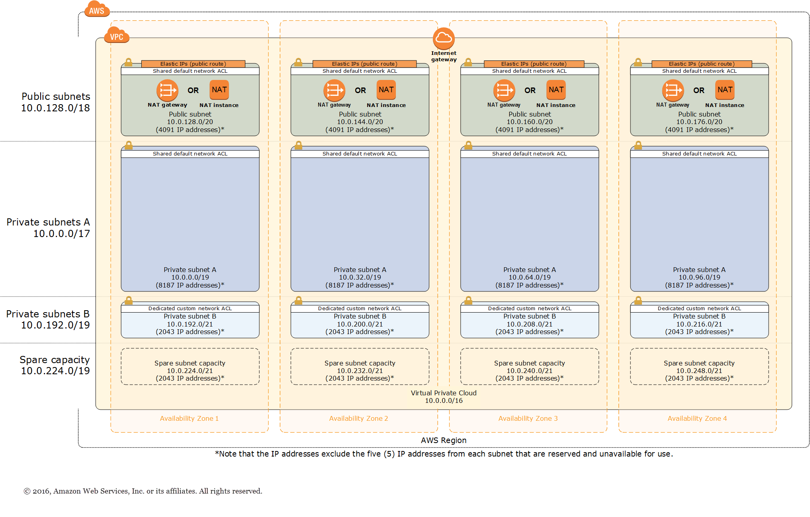
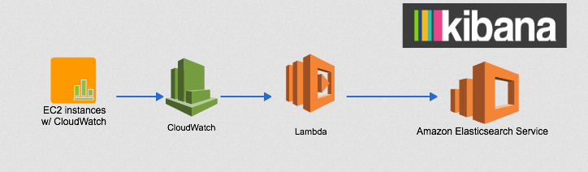

# northbay-gstn-kaf-elas
Cloudformation templates and scripts for a reference implementation of AWS Ground Station sending messages to a Kafka Cluster with Cloudwatch Streaming to ElasticSearch

[Northbay Blog](https://northbaysolutions.com/)
------------------------------------------------------------------------------------------

Bringing Space to the Cloud: A how to guide
==========================================================

### High-level solution overview

Today we're going to be showing you how to combine 4 cloud technologies into a cloud native satellite radio transmission receiver that streams in a highly scalable way to a searchable index.

## Components

Northbay has created a Cloudformation Template that downloads data from AWS Ground Station into AWS Elasticsearch using Kafka. The pipeline was created using the following components:

  AWS Ground Station

  AWS VPC quickstart

  Apache Kafka

Using Confluent Community Edition helper functions and Cluster Quickstart.
Amazon Cloudwatch streaming to Elasticsearch and displaying in Kibana - 

  Cloudwatch Streaming to ElasticSearch and Kibana

###

### TLDR Step by Step 

This demo allows you to stream any sample radio communication as an input. However if you want to use real satellite transmissions you will need to first onboard your AWS in Ground Station and apply for downlink only (read only) access to Norad id 27424, [Aqua](https://en.wikipedia.org/wiki/Aqua_(satellite)) precipitation, evaporation and water cycling data gathering satellite. 

Steps:

1. Generate a us-east-2 keypair if you don't have one already. 

Bash

    aws ec2 create-key-pair --key-name my_key --region us-east-2 | jq -r .KeyMaterial > my_key.pem

2. Create a bucket in us-east-2 to store and run the required templates and software. 

Bash

    your_bucket=my_bucket
    aws s3 mb s3://$your_bucket --region us-east-2
    git clone https://github.com/Sam-NB/northbay-gstn-kaf-elas
    cd northbay-gstn-kaf-elas 
    aws s3 sync . s3://$your_bucket --exclude ".git*"

3. Fire off the one-click cloudformation deploy. (us-east-2). (Costs will be incurred on your account but spot instances can be used see below)
Bash

    # setup some required vars
    Env=demo
    region=us-east-2
    my_ip=curl "http://myexternalip.com/raw"
    url=$(aws s3 presign s3://$your_bucket/src/templates/northbay-kafka-groundstation-elasticsearch-master.template.yaml)
    
    # create the aws resources via cf stack
    aws cloudformation create-stack --stack-name NB-Gstn-Kaf-Elas \
    --template-url $url \
    --region $region \
    --capabilities CAPABILITY_NAMED_IAM CAPABILITY_IAM \
    --parameters \
    ParameterKey=AquaGroundStationCFTemplateVersion,ParameterValue=1 \
    ParameterKey=AquaGroundStationCreateReceiverInstance,ParameterValue=true \
    ParameterKey=AssignPublicIP,ParameterValue=true \
    ParameterKey=AvailabilityZones,ParameterValue="${region}a\,${region}b" \
    ParameterKey=BootDiskSize,ParameterValue=24 \
    ParameterKey=BrokerNodeInstanceType,ParameterValue=m4.large \
    ParameterKey=BrokerNodeSpotPrice,ParameterValue=0.05 \
    ParameterKey=BrokerNodeStorage,ParameterValue=40 \
    ParameterKey=BrokerNodeStorageType,ParameterValue=gp2 \
    ParameterKey=ClusterName,ParameterValue=kafka \
    ParameterKey=ConfluentEdition,ParameterValue="Confluent Open Source" \
    ParameterKey=ConfluentVersion,ParameterValue=5.0.0 \
    ParameterKey=ConnectorURLs,ParameterValue=- \
    ParameterKey=EBSIOPS,ParameterValue=0 \
    ParameterKey=EBSVolumeSize,ParameterValue=10 \
    ParameterKey=EBSVolumeType,ParameterValue=gp2 \
    ParameterKey=ElasticSearchInstanceCount,ParameterValue=1 \
    ParameterKey=ElasticSearchInstanceType,ParameterValue=t2.small.elasticsearch \
    ParameterKey=ElasticsearchVersion,ParameterValue=7.4 \
    ParameterKey=Env,ParameterValue=$Env \
    ParameterKey=GroundStationInstanceType,ParameterValue=m5.4xlarge \
    ParameterKey=GroundStationSatelliteName,ParameterValue=AQUA \
    ParameterKey=GroundstationMessageLogGroupName,ParameterValue=/$Env/groundstation/messages \
    ParameterKey=IpoppPassword,ParameterValue=ComplexPassword123 \
    ParameterKey=KafkaTopic,ParameterValue=groundstation \
    ParameterKey=KafkaTopicPartitions,ParameterValue=1 \
    ParameterKey=KafkaTopicReplicationFactor,ParameterValue=0 \
    ParameterKey=KeyPairName,ParameterValue=my_key \
    ParameterKey=LinuxOSAMI,ParameterValue=Amazon-Linux-HVM \
    ParameterKey=LogGroupName,ParameterValue=/dev/groundstation/messages \
    ParameterKey=NumBrokers,ParameterValue=1 \
    ParameterKey=NumConsumerWorkers,ParameterValue=1 \
    ParameterKey=NumProducerWorkers,ParameterValue=1 \
    ParameterKey=NumZookeepers,ParameterValue=0 \
    ParameterKey=PrivateSubnet1CIDR,ParameterValue=10.0.0.0/19 \
    ParameterKey=PrivateSubnet2CIDR,ParameterValue=10.0.32.0/19 \
    ParameterKey=PublicSubnet1CIDR,ParameterValue=10.0.128.0/20 \
    ParameterKey=PublicSubnet2CIDR,ParameterValue=10.0.144.0/20 \
    ParameterKey=QSS3BucketName,ParameterValue=$your_bucket \
    ParameterKey=QSS3KeyPrefix,ParameterValue=src/ \
    ParameterKey=RemoteAccessCIDR,ParameterValue=$my_ip/32 \
    ParameterKey=SSHAccessCIDR,ParameterValue=$my_ip/32 \
    ParameterKey=VPCCIDR,ParameterValue=10.0.0.0/16 \
    ParameterKey=WorkerNodeInstanceType,ParameterValue=t3.micro \
    ParameterKey=WorkerNodeSpotPrice,ParameterValue=0.02 \
    ParameterKey=WorkerNodeStorage,ParameterValue=0 \
    ParameterKey=ZookeeperNodeInstanceType,ParameterValue=m4.large \
    ParameterKey=ZookeeperNodeSpotPrice,ParameterValue=0.05 \
    ParameterKey=ZookeeperNodeStorage,ParameterValue=0

4. Wait for EC2 instance bootstrap userdata to execute approx (5 minutes)
5. Add Bucket Notifications to push processed Gstation files into the kafka topic.

Bash

    #some required vars
    your_account=$(aws sts get-caller-identity --output text --query 'Account')
    lambda=$(echo S3ToKafkaTopic_$Env)

    #add permissions and notifications on both the bucket and lambda function
    sed  "s/LAMBDA_FUNCTION/$lambda/g; s/REGION/$region/g; s/ACCOUNT_ID/$your_account/g" src/templates/event_sub.json  > sub.json
    aws lambda add-permission --function-name $lambda --statement-id lambda_invoker --action "lambda:InvokeFunction" --principal s3.amazonaws.com --source-arn "arn:aws:s3:::$your_bucket" --source-account $your_account --region $region
    aws s3api put-bucket-notification-configuration --bucket $your_account --notification-configuration file://sub.json

6. Send sample radio data to the open port on one of the the kafka producer nodes or Schedule a contact in the Groundstation UI.  

7. Manual mode

Bash
    
    #download a sample Morse CW radio transmission
    wget https://upload.wikimedia.org/wikipedia/commons/9/9e/A_through_Z_in_Morse_code.ogg
    ffmpeg -i A_through_Z_in_Morse_code.ogg -f s16le -acodec pcm_s16le A_through_Z_in_Morse_code.raw
    
    #test connectivity and simulate a transmission
    producer=$(aws ec2 describe-instances --region us-east-2 --output text |dos2unix| sed ':a;N;$!ba;s/\n/ /g' | sed "s/\(RESERVATIONS\)/\n\1/g" | grep kafka-producer | awk '{print $43}')
    nc -vz $producer 7355 -u

    cat A_through_Z_in_Morse_code.raw | multimon-ng -a MORSE_CW -t raw -
    cat A_through_Z_in_Morse_code.raw | aplay -r 48k -f S16_LE -t raw -c 1
    cat A_through_Z_in_Morse_code.raw | nc $producer 7355 -u

In order to save costs while waiting for your scheduled satellite contact you can safely stop the receiver and processor instances and simply start them up 15 minutes before your receive window. After processing they can be safely stopped until you need them again next time. 

###

### Details of what happening in each step

###

AWS Ground Station

Before you start using AWS Ground Station you will need to complete the registration for your AWS Ground Station account. See the Satellites and Resources section in the AWS Ground Station console page for onboarding details.  

Once you have completed the onboarding steps you may proceed with the following steps:

Apache Kafka - Confluent Platform on the AWS Cloud
We used the Confluent Platform for streaming in a  large-scale distributed environment built on Apache Kafka. The Confluent Platform on AWS Quick Start is for users who are looking to evaluate and use the full range of Confluent Platform and Apache Kafka capabilities in the managed infrastructure environment of AWS. 
This Quick Start deploys Confluent Platform using AWS CloudFormation templates. You can use the Quick Start to build a new virtual private cloud (VPC) for your Confluent Platform cluster, or deploy Confluent Platform into an existing VPC.
We created a Kafka Cluster using the following configurations:
 
Broker Node Instance Type:        m4.large (1)
Producer Node Instance Type:    m4.xlarge (1)
Consumer Node Instance Type:    m4.xlarge (1)
Confluent Edition:            Confluent Open Source
Topic:                    groundstation
 

groundstation-broker-0 - Kafka Broker stores messages for Kafka topic groundstation
groundstation-producer-0 - Reads data from radio and sends messages to Kafka topic groundstation
groundstation-consumer-0 - Reads messages from Kafka topic groundstation and spools to a local file groundstation.log
Amazon Cloudwatch
We used Amazon Cloudwatch to collect messages from Kafka because the service has inbuilt functionality to stream data that it receives to Amazon Elasticsearch Service in near real-time through a CloudWatch Logs subscription. 

To accomplish this we configured an Amazon Cloudwatch Agent on the Kafka consumer and set up a subscription on the Amazon Cloudwatch Log Group to send messages to Amazon Elasticsearch service using Lambda.
Amazon Cloudwatch Agent Configuration
An Amazon Cloudwatch Agent is configured on the Kafka Consumer (groundstation-consumer-0) which collects the messages in groundstation.log and transfers them to Amazon Cloudwatch.

log-config.json
{
 "version":"1",
 "log_configs":[{"log_group_name":"/dxc/dev/groundstation/messages"}],
 "Region":"us-east-2"
}

amazon-cloudwatch-agent.toml
[agent]
  collection_jitter = "0s"
  debug = false
  flush_interval = "1s"
  flush_jitter = "0s"
  hostname = ""
  interval = "60s"
  logfile = "/opt/aws/amazon-cloudwatch-agent/logs/amazon-cloudwatch-agent.log"
  metric_batch_size = 1000
  metric_buffer_limit = 10000
  omit_hostname = false
  precision = ""
  quiet = false
  round_interval = false

[inputs]

  [[inputs.tail]]
    data_format = "value"
    data_type = "string"
    file_state_folder = "/opt/aws/amazon-cloudwatch-agent/logs/state"
    name_override = "raw_log_line"

    [[inputs.tail.file_config]]
      file_path = "/var/log/groundstation.log"
      from_beginning = true
      log_group_name = "/dxc/dev/groundstation/messages"
      log_stream_name = "i-02728618e6211bd5a"
      pipe = false
    [inputs.tail.tags]
      metricPath = "logs"

[outputs]

  [[outputs.cloudwatchlogs]]
    file_state_folder = "/opt/aws/amazon-cloudwatch-agent/logs/state"
    force_flush_interval = "5s"
    log_stream_name = "i-02728618e6211bd5a"
    region = "us-east-2"
    tagexclude = ["metricPath"]
    [outputs.cloudwatchlogs.tagpass]
      metricPath = ["logs"]

### Sam Zahabi

Sam is a Solutions Architect with NorthBay Solutions (NBS)
Professional Services. NorthBay works closely with customers to help rapidly
realize their goals using AWS services.

### Manoj Kukreja

Manoj is a Cloud Data Architect with NorthBay Solutions (NBS)
Professional Services. NorthBay works closely with customers to help rapidly
realize their goals using AWS services.

### Ritesh Kuchukulla

Ritesh is a Cloud Solutions Engineer with NorthBay Solutions (NBS)
Professional Services. NorthBay works closely with customers to help rapidly
realize their goals using AWS services.

### Resources

<a href="https://northbaysolutions.com/resources/" class="lb-txt-none lb-txt">NBS Resources</a>

------------------------------------------------------------------------

### Follow

<a href="https://twitter.com/northbays" class="lb-txt-none lb-txt"><em></em> NBS Twitter</a>

**
